<!-- .slide:data-background="#1A3819" -->
## Memory Leak
<blockquote>a memory leak is a type of <strong>resource leak</strong> that occurs when a computer program incorrectly manages memory allocations in such a way that <em>memory which is no longer needed is not released</em></blockquote>

-----

## Memory Leak 징후
<ul>
    <li class="fragment">페이지가 느리다.</li>
    <li class="fragment">페이지가 시간이 지날수록 점점 느려진다.</li>
    <li class="fragment">단말기 마다, 환경마다 증상의 차이가 크다.</li>
    <li class="fragment">페이지의 동작이 잠시 멈춘다.</li>
    <li class="fragment">브라우저가 죽는다(crashed)
    </li>
</ul>

<strong class="fragment">성능 문제와 같은데?</strong>

-----

## 왜 Memory leak은 발생하는가?
<h3 class="fragment"><strong>잘못 사용된 개발 패턴</strong></h3>

-----

## 전 별로 신경쓰지 않았는데...
## 잘 되던데요 ^^
<h3 class="fragment"><em>네. 맞습니다</em></h3>

-----

## 모던 브라우저는 <strong>Reloading</strong>시 메모리를 효과적으로 릴리즈합니다.

-----

## 하지만, 당신이 개발하는 서비스가 <em>SPA</em>라면 상황은 달라집니다
<small>SPA : Single-Page Application</small>

-----

# Memory

-----

### Think of memory as a graph
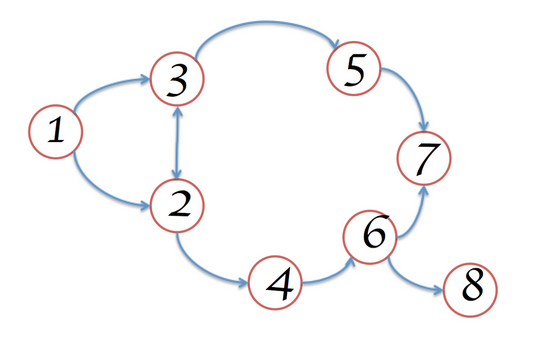

-----

## Types
<ul>
    <li>
        
Primitive types : Number, Boolen, String

        <em class="fragment">다른 값의 reference를 갖을 수 없음</em>
    </li>

    <li class="fragment">
        
Object(key-value), Array<i>(number key-value)</i>

        <em class="fragment">다른 값의 reference를 가짐</em>
        
<strong class="fragment">Memory leak 관리 대상</strong>

    </li>
</ul>

-----

Object는 <em>Object와 Array</em>

-----

### GC (Garbage Collection)
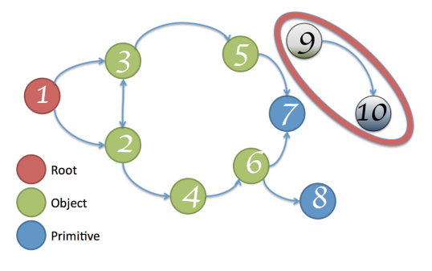

<strong>Root와 연결이 끊어진 node</strong>의 메모리를 해제하는 작업

-----

### Memory Leak을 제거 하는 방법

사용한 <em>Object, Array</em>의 Reference가

<strong>Root와 연결되지 않도록 한다.</strong>

-----

<!-- .slide: data-background="#1A3819" -->
### Memory Leak이 발생 할 수 있는
## 3가지 개발 패턴

-----

## 1. Timers

-----

<pre><code>var buggyObject = {
    callAgain: function () {
        var ref = this;
        var val = setTimeout(function () {
            console.log('Called again: ' + new Date().toTimeString());
            ref.callAgain();
        }, 1000);
    }
};
buggyObject.callAgain();
<mark class="fragment" data-fragment-index="1">buggyObject = null; // buggyObject reference 제거</mark>
</code></pre>

timer 내부에서 buggyObject reference가 여전히 존재함

-----

<pre><code>var buggyObject = {
    callAgain: function () {
        <mark>function loopFunc() {</mark>
            console.log('Called again: ' + new Date().toTimeString());
            setTimeout(loopFunc, 1000);
        <mark>}</mark>
        <mark>setTimeout(loopFunc, 1000);</mark>
    }
};
buggyObject.callAgain();
buggyObject = null; // buggyObject reference 제거
</code></pre>

timer 내부에서 buggyObject reference를 사용하지 않는다.

-----

## 2. Closures

<blockquote>외부함수의 변수에 접근할 수 있는 내부 함수. 
함수와 그 함수가 만들어진 환경으로 이루어진 객체
</blockquote>

-----

<pre><code data-noescape>var a = function () {
    var largeStr = new Array(1000000).join('x');
    return <mark>function () {</mark>
     return largeStr;
    <mark>};</mark>
}();
</code></pre>

반환된 closure는 largeStr 변수의 레퍼런스가 가지고 있음

-----

Closure는 실용적인 프로그래밍을 할수 있습니다.

하지만, <strong>무분별한 Closure</strong>는 Memory leak을 유발합니다.

-----

## 3. DOM leaks

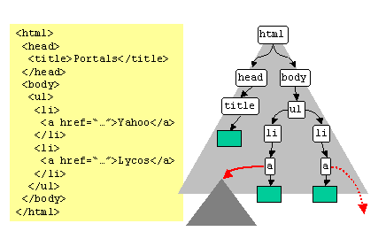

-----

<blockquote>DOM node는 <em>DOM Tree에서 삭제</em>되었지만, 여전히 <strong>DOM node의 reference가 존재</strong>하는 경우
</blockquote>

-----

    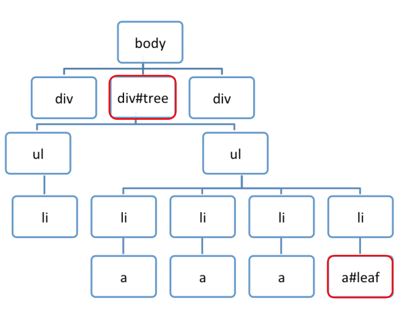

    <pre><code data-noescape>var select = document.querySelector;
var treeRef = select("#tree");
var leafRef = select("#leaf");
var body = select("body");

<mark class="fragment" data-fragment-index="1">body.removeChild(treeRef);</mark>

<mark class="fragment" data-fragment-index="2">treeRef = null;</mark>

<mark class="fragment" data-fragment-index="3">leafRef = null;</mark>
</code></pre>

    
<strong>treeRef</strong> 때문에, GC가 발생하지 않음

    
<em>leafRef</em> 때문에, GC가 발생하지 않음

-----

### Event listeners

-----

노트를 만드는 예제

<pre><code data-noescape>var Area = document.getElementById('area');
function addNote(index) {
  var note = document.createElement('DIV');
  note.id = 'note' + index;
  note.innerHTML = '&lt;div&gt;노트 입니다.&lt;button class="close"&gt;&lt;/div&gt;';
  Area.appendChild(note);
  note.querySelector('button.close').addEventListener('click', onClickClose);
}
function removeNote(index) {
  var note = document.getElementById(id);
  Area.removeChild(note);
  <mark class="fragment" data-fragment-index="5">note.querySelector('button.close').removeEventListener('click', onClickClose);</mark>
}
<mark class="fragment" data-fragment-index="3">addNote(0); removeNote(0);
addNote(1); removeNote(1);</mark>
</code></pre>

<em>이벤트</em>를 dettach 하지 않기 때문에, GC가 발생하지 않음

-----

<pre><code data-noescape>var Area = document.getElementById('area');
function addNote(index) {
  var note = document.createElement('DIV');
  note.id = 'note' + index;
  note.innerHTML = '&lt;div&gt;노트 입니다.&lt;button class="close"&gt;&lt;/div&gt;';
  Area.appendChild(note);
}
function removeNote(index) {
  Area.removeChild(document.getElementById(id));
}
<mark>function handler(e) {
    if(e.target.nodeName === 'button'
        &amp;&amp; e.target.classList.contains('close') ) {
        onClickClose(e);
    }
}</mark>
<mark>Area.addEventListener('click', handler);</mark>
addNote(0); removeNote(0);
addNote(1); removeNote(1);
<mark>Area.removeEventListener('click', handler);</mark></code></pre>

<em>이벤트 delegate</em>을 이용하여 개발

-----

<!-- .slide: data-background="#1A3819" -->
### Chrome DevTools를 이용한
## Memory Leak 분석하기

-----

### 문제를 해결하는 방법
<ol>
    <li class="fragment">문제를 <strong>재연</strong>시키고, 확인하라</li>
    <li class="fragment">문제 원인의 <em>범위를 파악</em>하라</li>
    <li class="fragment">문제를 <em>분석하고, 적용</em>하라</li>
    <li class="fragment">목표점에 도달하기 까지 이를 <strong>반복</strong>하라.</li>
</ol>

-----

### 문제를 <em>재연</em>시키고, 확인하라
<ul>
    <li class="fragment">현재 상태 확인</li>
    <li class="fragment">목표 지표 확인</li>
</ul>

<strong>AS-IS와 TO-BE를 설정</strong>

-----

#### 전체 메모리, CPU 사용량 보기

Task Manager (옵션 > 도구 더보기 > 작업관리자)

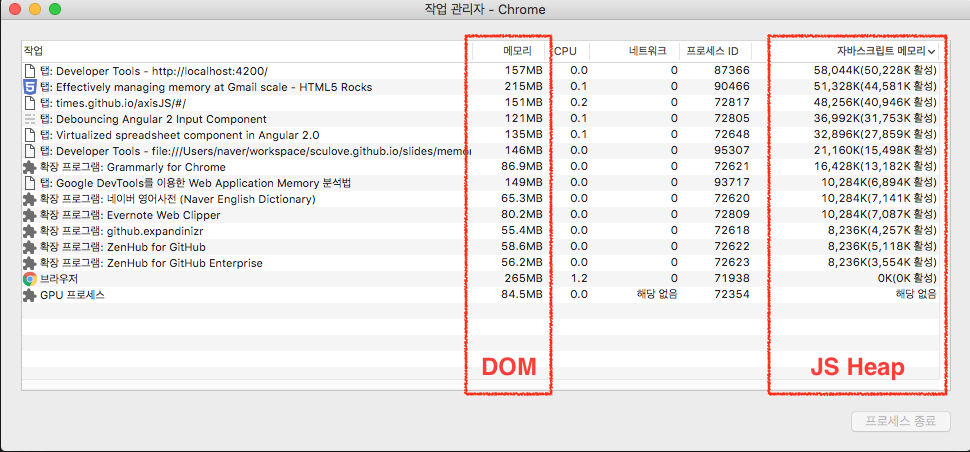
<small>JavaScript Memory(JS Heap)와 Memory (DOM)</small>

-----

#### Timeline으로 확인하기 (1/3)

DevTools > Timeline tab, check `memory`

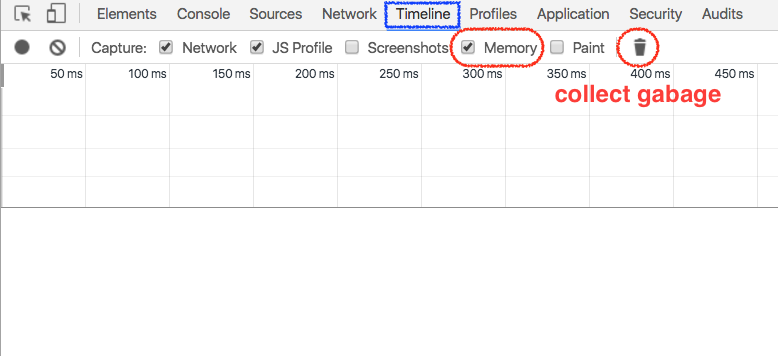
<small>확장 프로그램을 제외하기 위해, 시크릿 창으로 Chrome을 열어 확인한다</small>

-----

#### Timeline으로 확인하기 (2/3)
<ol>
    <li>Record 시작</li>
    <li>GC 버튼을 일정 시간 간격으로 몇차례 눌러, <strong>강제로 메모리를 릴리즈</strong>한다.</li>
    <li>Record 중지</li>
</ol>
<a href="./demo/grow.html" target="_blank">Grow DEMO</a>

-----

#### Timeline으로 확인하기 (3/3)

Memory Leak이 존재하면 <strong>계단형</strong>의 timeline을 보임

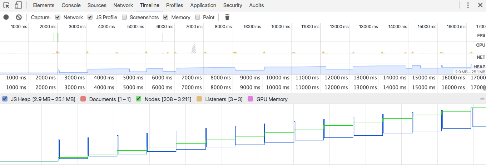

JS Heap이 <em>계단형</em>, Nodes가 <em>계단형</em>

JS Heap이 <strong>Memory Leak</strong>, Nodes가 <strong>Memory Leak</strong>

-----

### 2. 문제 원인의 범위를 파악하라

-----

<ul>
    <li><strong>성능</strong>이 문제인가?
        <ul class="fragment">
            <li>Timeline을 통한 <em>Bottleneck</em> 확인</li>
            <li>CPU Profile을 통한 <em>CPU 사용량</em> 확인</li>
        </ul>
    </li>
    
&nbsp;

    <li class="fragment"><strong>메모리</strong>가 문제인가?
        <ul class="fragment">
            <li>Profile을 통한 <em>Memory 사용량</em> 확인</li>
            <li>Profile을 통한 <em>Memory Leak</em> 확인</li>
        </ul>
    </li>
</ul>

-----

### 3. 문제를 분석하고, 적용하라
<ul>
    <li class="fragment">문제를 분리하라</li>
    <li class="fragment">문제를 제외한 외부요소를 통제하라</li>
    <li class="fragment">문제를 <strong>분석</strong>하라</li>
</ul>

-----

### Profile 하기
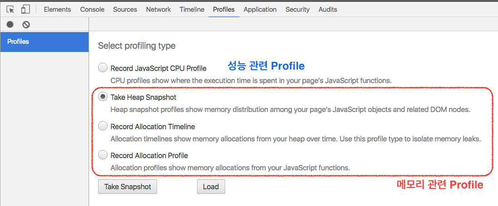
<small>profile 측정 전에 GC를 자동 실행한다</small>

-----

### 메모리 관련 툴
<ul>
    <li>
        Take Heap Snapshot
      
<em>JavaScript Object</em> and related <em>DOM nodes</em>

            <pre class="fragment"><code>kill -6 pid</code></pre>
    </li>
    <li class="fragment">
        Record Allocation Timeline
        
시간 기준으로 할당과 해제를 반복하여, <strong>남겨진 메모리</strong>를 확인

  </li>
  <li class="fragment">
    Record Allocation Profile
    
<em>JavaScript 함수</em> 기준으로 메모리량 확인

  </li>
</ul>

-----

### Take Heap Snapshot

Snapshot을 뜬 후, <strong>비교</strong>를 통해 변경된 메모리 세부 내역을 확인한다

-----

### 그 전에 알아야할 메모리 관련 용어

-----

#### Shallow Size 와 Retained Size
<ul>
    <li class="fragment">
        Shallow Size
      
array, string와 같이 직접적으로 메모리를 점유하고 있는 JavaScript 객체들의 크기 <em>실제 데이터가 있는 영역</em>

    </li>
    <li class="fragment">
        Retained Size
        
GC이후 남겨진 메모리의 크기. 즉, <em>실제 사용중인 JS Heap의 크기</em>

    </li>
</ul>

<strong>Shallow Size는 작지만, Retained Size가 굉장히 많다면?</strong>

Memory leak을 의심하라

-----

#### Distance

GC root로 부터의 Retaining Path

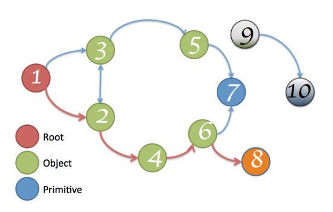 
<small>8의 distance는 4</small>

-----

### Profile의 View 타입

-----

#### Summary View

<em>constructor 그룹별</em>로 보여주는 뷰

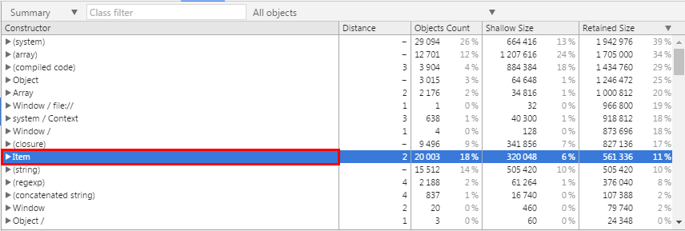

-----

#### Comparison View

constructor 그룹별로 보여주고, <em>2개의 Snapshot의 차이를 표시</em>해주는 뷰

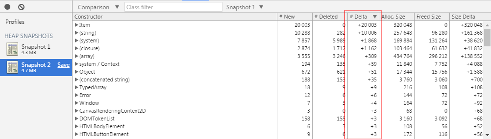

-----

#### Containment View

JS Heap 메모리의 <em>Object 구조</em>를 보여주는 뷰

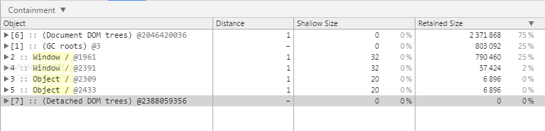

-----

#### Statistics View

메모리 사용량을 <em>파이 차트</em>로 보여주는 뷰

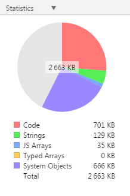

-----

#### DEMO

    Summary/Comparison View :
    <a href="./demo/view.html" target="_blank">View DEMO</a>

Containment/Statistics View :
    <a href="./demo/domleak.html" target="_blank">DOM Leak DEMO</a>

-----

### Record Allocation Timeline

<strong>Memory leak</strong> 확인시 용이<small><a href="./demo/grow.html" target="_blank">Grow DEMO</a></small>

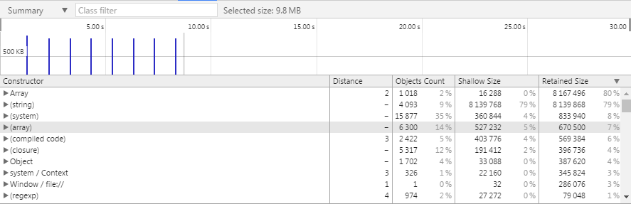
<small>파란색바 메모리 할당.</small>&nbsp;&nbsp;&nbsp;
<small>회색바 메모리 해지.</small>

-----

### Record Allocation Profile

<strong>함수별 메모리 사용량</strong> 파악시 용이 <small><a href="./demo/grow.html" target="_blank">Grow DEMO</a></small>

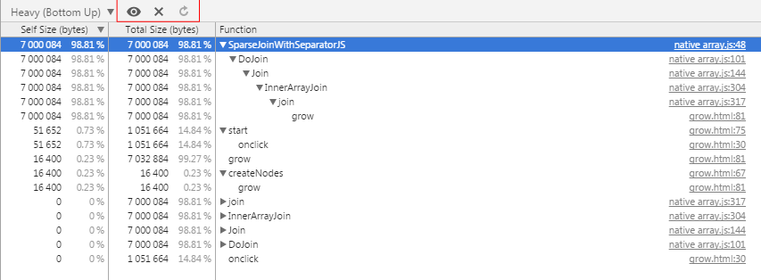
<small>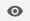 선택된 함수 중심으로 보기</small>&nbsp;&nbsp;
<small>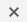 선택된 함수 숨기기</small>&nbsp;&nbsp;
<small>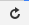 초기화하기</small>

<!-- .element: class="fragment" --> <strong>Tip.</strong> anonymous 함수가 아닌 함수명을 지정한다.

-----

## 정리
<ul>
    <li class="fragment">Memory Leak과 Memory</li>
    <li class="fragment">Memory Leak이 발생할수 있는 3가지 개발 패턴</li>
    <li class="fragment">CHROME DEVTOOLS를 이용한
MEMORY LEAK 분석하기</li>
</ul>

-----

-----

## Reference
<ul style="font-size:24px;line-height:35px">
    <li>
        Effectively Managing Memory at Gmail scale 
        <a href="http://www.html5rocks.com/en/tutorials/memory/effectivemanagement/" target="_new">http://www.html5rocks.com/en/tutorials/memory/effectivemanagement/</a>
    </li>
    <li>
        Fix Memory Problems 
        <a href="https://developers.google.com/web/tools/chrome-devtools/profile/memory-problems/?hl=en" target="_new">https://developers.google.com/web/tools/chrome-devtools/profile/memory-problems/?hl=en</a>
    </li>
    <li>
        Finding and debugging memory leaks in JavaScript with Chrome DevTools 
        <a href="http://slides.com/gruizdevilla/memory" target="_new">http://slides.com/gruizdevilla/memory</a>
    </li>
    <li>
        nhnent/fe.javascript wiki 
        <a href="https://github.com/nhnent/fe.javascript/wiki/August-22-August-26,-2016" target="_new">https://github.com/nhnent/fe.javascript/wiki/August-22-August-26,-2016</a>
    </li>
</ul>