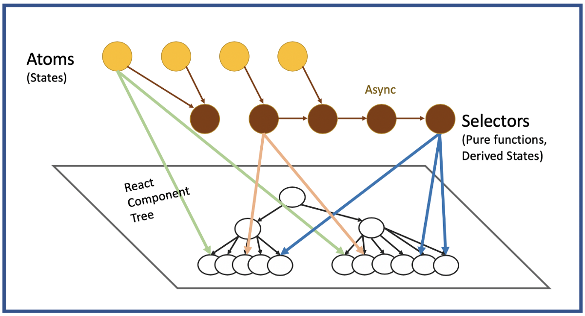
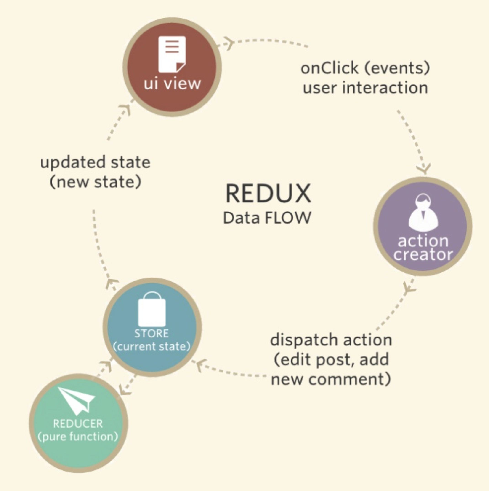

### 상태 관리는 왜 필요한가?

 <!-- .element: style="height:450px" -->

-----

Web page에서 **Web Application**이 되면서 <strong class="red">복잡해짐</strong>

 <!-- .element: style="height:450px" -->


-----

다양한 <strong>비동기</strong> 입출력에 의한 빈번한 변화
- 사용자 입력 <!-- .element: class="fragment" -->
- 서버 자원 요청 <!-- .element: class="fragment" -->
- 브라우저 이벤트 <!-- .element: class="fragment" -->
- 애니메이션 <!-- .element: class="fragment" -->
- ... <!-- .element: class="fragment" -->

-----

### State 란 무엇인가?

<div style="display:flex">
  <div style="flex-grow:1">
    <iframe 
      data-src="https://m.blog.naver.com/crazymonlong/221975164518" 
      data-preload
      width="400px"
      height="500px"
      ></iframe>
  </div>
  <div style="flex-grow:1">
    <ul>
      <li>UI 영역별 상태</li>
      <li>UI 영역 간의 상태</li>
      <li>전역 상태</li>
    </ul>
  </div>
</div>

-----

### 상태 관리 라이브러리

- Redux <!-- .element: class="fragment highlight-red" data-fragment-index="3" -->
- Mobx
- Recoil <!-- .element: class="fragment"  data-fragment-index="1" -->
- Fetch + 상태관리 <!-- .element: class="fragment"  data-fragment-index="2" -->
<small>(SWR, react-query, apollo-client, ...)</small> <!-- .element: class="fragment"  data-fragment-index="2" -->

<small class="fragment" data-fragment-index="3"><a href="https://2020.stateofjs.com/en-US/technologies/datalayer/" target="_blank_">2020.stateofjs.com DataLayer</a></small>

-----

<!-- .slide:data-background="#e7ad52" data-transition="zoom" -->
## DataFlow

-----

### MVC (Model-View-Controller)
Controller는 Model과 View를 제어

 <!-- .element: style="height:400px" -->


-----

### MVC (Model-View-Controller)
View 업데이트를 위해서 M-V 사이에 <strong>의존성이 생김</strong>

 <!-- .element: style="width:600px" -->


-----

### MVC의 변형

> MVC는 시스템이 커질수록<br> <strong>유지보수와 확장이 어려워짐</strong>

- <!-- .element: class="fragment" --> MVP(Model-View-<strong class="blue">Presenter</strong>)
- <!-- .element: class="fragment" --> MVVM(Model-View-<strong class="blue">ViewModel</strong>)
- <!-- .element: class="fragment" --> <strong class="red">Flux</strong> 

-----

### Flux

- Facebook에서 2014.05 F8에서 공개
- <small>Model과 View의 관계보다</small> **예측성을 높이고 싶다**
- <!-- .element: class="fragment" --> <strong class="red">Single Directional Data Flow</strong>

-----

### Flux

 <!-- .element: style="width:600px" -->

-----

<!-- .slide: data-auto-animate -->
### MVC VS Flux

 <!-- .element: style="width:600px" -->
<small>MVC</small>

-----

<!-- .slide: data-auto-animate -->
### MVC VS Flux

 <!-- .element: style="width:600px" -->
<small>MVC</small>
 <!-- .element: style="width:600px" -->
<small>Flux</small>

-----

<!-- .slide:data-background="#8c4738" data-transition="zoom"-->
## Flux 영향을 받은 구현체

-----

### Redux DataFlow
Immutable Single Store

 <!-- .element: style="height:450px" -->

-----

### Mobx DataFlow

<!-- .slide: data-auto-animate -->
Class 기반의 [Observer Pattern](https://ko.wikipedia.org/wiki/%EC%98%B5%EC%84%9C%EB%B2%84_%ED%8C%A8%ED%84%B4)

 <!-- .element: style="width:800px" -->

-----

### Mobx DataFlow

<!-- .slide: data-auto-animate -->
Class 기반의 [Observer Pattern](https://ko.wikipedia.org/wiki/%EC%98%B5%EC%84%9C%EB%B2%84_%ED%8C%A8%ED%84%B4)

 <!-- .element: style="width:800px" -->

<small><a href="https://mobx.js.org/reactions.html#example">example</a><small>

-----

### Recoil DataFlow

<!-- .slide: data-auto-animate -->
 <!-- .element: style="height:450px" -->

-----

### Recoil DataFlow

<!-- .slide: data-auto-animate -->
 <!-- .element: style="width:800px" -->

<small><a href="https://recoiljs.org/ko/docs/introduction/getting-started#recoilroot" >example</a></small>

-----

<!-- .slide:data-background="#e7ad52" data-transition="zoom" -->
## Redux

-----

> Redux is<br>a <strong class="red">predictable state container</strong> for JavaScript Apps.

- Dan abramov에 의해 2015년 6월경에 개발
- <strong>Flux</strong>와 <strong>함수형 프로그래밍 패러다임</strong>에 영향을 받음

-----

### Redux를 이해하기 위한<br> 함수형 프로그래밍

^^^^^

### 함수형 프로그래밍 

> 함수형 프로그래밍(functional programming)은 자료 처리를 <strong class="blue">수학적 함수의 계산</strong>으로 취급하고 <strong class="red">상태와 가변 데이터를 멀리하는</strong> 프로그래밍 패러다임의 하나이다.

<small><a href="https://ko.wikipedia.org/wiki/%ED%95%A8%EC%88%98%ED%98%95_%ED%94%84%EB%A1%9C%EA%B7%B8%EB%9E%98%EB%B0%8D">wikipedia</a></small>

^^^^^

#### 1) 수학적 함수의 계산 - High Order Function

다른 함수를 인자로 받거나 그 결과로 함수를 반환하는 함수

> 고차함수는 변경되는 주요 부분을 함수로 제공함으로서 <strong class="red">동일한 패턴 내에 존재하는 문제를 손쉽게 해결</strong>할 수 있는 고급 프로그래밍 기법


<small><a href="https://en.wikipedia.org/wiki/Higher-order_function">wikipedia</a></small>

^^^^^

```js [|2,7,11,13,15|3,6,8,14|1,10]
let result = 0;
if(A) {
  for(let i=0; i<len; i++) {
    // Biz 로직 A
    result+= 10;
  }
} else {
  for(let i=0; i<len; i++) {
    // Biz 로직 B
    result+= 20;
    if(B) {
      // 여기에도 if문이...
    }
  }
}
```

^^^^^

흔히 사용하고 있는 High Order Function

- filter <strong class="fragment">조건문</strong>
- forEach <strong class="fragment">반복문</strong> 
- map <strong class="fragment">반복문 + 변환(연산)</strong> 
- reduce <strong class="fragment">반복문 + 누적(연산)</strong> 

^^^^^

```js [|3,11|4,10|2,9]
function process(people) {
  const html = [];
  for (let user of people.results) {
    if (/male|female/.test(user.gender)) {
      const result = logic(user.height, user.mass, user.gender);
      user = { ...user,
        ...result
      };
      html.push(makeHtml(user));
    }
  }
  return html.join("");
}
```

^^^^^

```js [|3|4,10]
function process(people) {
  return people.results
    .filter(user => /male|female/.test(user.gender))
    .reduce((html, user) => {
      html.push(makeHtml({
        ...user,
        ...logic(user.height, user.mass, user.gender)
      }));
      return html;
    }, [])
    .join("");
}
```

^^^^^

#### 2) 상태 변경과 가변 데이터를 피하는

<p class="fragment">문제는 <strong class="red">변수</strong>로 부터 발생한다.</p>

^^^^^

```js [|7|8]
const param = {
  name: "warren",
  family: ["jessica", "warren", "june", "seo"]
};

function getFamilyCount(param) {
  param.name = "son chan uk";
  return new Date().toLocaleDateString() + " " + family.length;
}

```

^^^^^

#### 부원인(Side Cause)과 부작용(Side Effect)

> 함수에 드러나지 않는<br> 입력값 또는 출력값이 <strong class="blue">Side Cause</strong> <br>
> 이로 인해 발생한 결과를 <strong class="blue">Side Effect</strong>

^^^^^

#### Mutable Object와 Immutable Object

- Mutable: 생성 후에 상태를 <strong>변경할 수 있는</strong> 객체
  - <!-- .element: class="grey" --> 예) Array, Object
- Immutable: 생성 후에 상태를 <strong>변경할 수 없는</strong> 객체
  - <!-- .element: class="grey" --> 예) Number, Boolean, String

^^^^^

```js [|6|7]
const animals1 = ["ant", "bison", "camel", "june", "seo"];
const animals2 = ["ant", "bison", "camel", "june", "seo"];

console.log(animals1.splice(2)); // ["camel", "june", "seo"]
console.log(animals2.slice(2)); // ["camel", "june", "seo"]
// animals1 => ["ant", "bison"]
// animals2 => ["ant", "bison", "camel", "june", "seo"];
```

^^^^^

### 함수형 프로그래밍은

- Side Effect를 지양
   - 같은 입력, 같은 출력을 하는 <strong class="red">순수함수</strong>를 지향
- <strong>Immutable Object</strong>를 지양
   - 상태가 바뀌었다면 eference가 변경된 것
   - reference가 바뀌었다면 상태가 바뀐 것

^^^^^

### 함수형 프로그래밍은

> 같은 입력, 같은 출력

- 테스트 용이
- 동시성 처리가 용이
- 버그 발생율이 낮다

-----

### Redux
- Flux와 같이 **단방향 데이터 플로우**
  - Store is Single and Read-Only <!-- .element: class="grey" -->
  - Changes are Made with Reducer Function <!-- .element: class="grey" -->
- 함수형 프로그램 패러다임을 지향
  - <!-- .element: class="grey" --> reducer를 side effect가 없는 <strong class="red">순수함수</strong>로 구성 
  - <!-- .element: class="grey" --> 상태 변화가 일어날 때 <strong class="blue">항상 새로운 reference를 반환</strong> (action, store)

-----

### Redux

<strong>Immutable Single Store + Pure Reducer Functions</storong>

 <!-- .element: style="height:450px" -->


-----

### Redux Getting Started

 <!-- .element: style="width:600px"-->

^^^^^

#### Action

[FSA(Flux-Standard-Action)](https://github.com/redux-utilities/flux-standard-action)

type, payload, error, meta <!-- .element: class="grey" -->

```js [|4]
// 입금 하기
export function deposit(value) {
  return {
    type: "DEPOSIT",
    payload: {
      value
    }
  }
}
```

^^^^^

#### Reducer

```js [|5|10-11]
export const initialState = {
  value: 0
};

export default function bankReducer(state = initialState, action) {
  switch(action.type) {
    // 입금할때의 store 상태
    case "DEPOSIT":   
      return {
        ...state,
        value: state.value + action.payload.value
      };
    default:
      return state;
  }
}
```

^^^^^

#### Store

```js[|4]
import {createStore} from "../node_modules/redux/es/redux.mjs";
import bankReducer from "./reducer.mjs";

const store = createStore(bankReducer);
```

^^^^^

#### Store 변경하기

```js
// dispatch
store.dispatch(deposit(10));
```

^^^^^

#### Store 결과 반영하기

```js

// store 구독
const unsubscribe = store.subscribe(() => {
  store.getState(); // { value: 0}
});
```

^^^^^

#### 예금 잔고 예제 완성하기 - 실습

withdraw 기능을 구현한다.

-----

<!-- .slide:data-background="#8c4738" data-transition="zoom"-->
## Redux 미들웨어 


-----

### Redux 미들웨어 
<!-- .slide: data-auto-animate -->


- Action과 Reducer 사이의 존재
 <!-- .element: style="width:600px;background-color:white; padding: 10px"-->

-----

### Redux 미들웨어 

<!-- .slide: data-auto-animate -->
- 중첩 Middleware를 통한 전달
 <!-- .element: style="width:600px"-->


-----

### 미들웨어 사용의 예 - 로깅

```js [|4|5|6|9|12]
// - 기능: action 전후의 상황을 기록한다.
// - console.group을 이용하여 action명 단위로 로그를 기록한다.
// - action 호출 전/후 state는 console.table로 로그를 표시한다.
export default function loggerMiddleware(store) {
  return function(next) {
    return function(action) {
      console.group(action.type);
      console.table(store.getState());
      const result = next(action);
      console.table(store.getState());
      console.groupEnd(action.type);
      return result;
    }
  } 
}
```

^^^^^

#### 미들웨어 적용

```js [|1|5|7]
import {createStore, applyMiddleware} from "../node_modules/redux/es/redux.mjs";;
import loggerMiddleware from "./loggerMiddleware.mjs";
import bankReducer from "./reducer.mjs";

const middlewareEnhancer = applyMiddleware(loggerMiddleware, /* ... */);

const store = createStore(bankReducer, middlewareEnhancer);
```

-----

### 미들웨어 사용의 예 - 비동기 요청 (Redux-thunk)

- Dan Abramov가 개발
- 객체가 아닌 **함수**를 반환하는 Action Creator를 dispatch 할 수 있다.

```js
const actionX = { type: "actionX", payload: 1+2 };
const actionFuncX = () => {
  return { type: "actionX", payload: 1+2 };
};
```

^^^^^

#### 비동기 요청 (Redux-thunk)

 <!-- .element: style="height:450px"-->

^^^^^

#### redux-thunk 적용하기

```js [|2|6-9]
import {createStore, applyMiddleware} from "../node_modules/redux/es/redux.mjs";
import thunkMiddleware from "../node_modules/redux-thunk/es/index.js";
import loggerMiddleware from "./loggerMiddleware.mjs";
import bankReducer from "./reducer.mjs";

const middlewareEnhancer = applyMiddleware(
  loggerMiddleware, 
  thunkMiddleware
);

const store = createStore(bankReducer, middlewareEnhancer);
```

^^^^^

#### Action 적용하기

```js [|3-4,12|6-11]
// 1초 후 입금 하기
export function asyncDeposit(value) {
  // 함수를 반환
  return (dispatch, getState) => {
    setTimeout(() => {
      dispatch({
        type: "DEPOSIT",
        payload: {
          value
        }
      });
    }, 1000)
  }
}
```

^^^^^

#### 예금 잔고 비동기 예제 완성하기 - 실습

asyncWithdraw 기능을 구현한다.

^^^^^

#### 비동기 상황에서의 상태 변화
<strong>isLoading, error, data</strong> 로 분리

 <!-- .element: style="height:450px"-->

^^^^^

#### 3가지 상태에 대한 Action (시작, 완료, 에러)

```js [|1-10|12-22|24-33|35-48|38,47|40|42|45]
// 입금이 시작된 상태
function startDeposit() {
  return {
    type: "START_DEPOSIT",
    payload: {
      isLoading: true,
      error: false,
    }
  }
}

// 입금 하기
function deposit(value) {
  return {
    type: "DEPOSIT",
    payload: {
      isLoading: false,
      error: false,
      value
    }
  }
}

// 입금시 에러가 난 상태
function errorDeposit() {
  return {
    type: "ERROR_DEPOSIT",
    payload: {
      isLoading: false,
      error: true
    }
  }
}

// 1초 후 입금 하기
export function asyncDeposit(value) {
  // 함수를 반환
  return (dispatch, getState) => {
    try {
      dispatch(startDeposit())
      setTimeout(() => {
        dispatch(deposit(value));
      }, 1000)
    } catch(e) {
      dispatch(errorDeposit())
    }
  }
}
```

^^^^^

#### 3가지 상태의 reducer (시작, 완료, 에러)

```js [|3-4,7-8|10-11,14-16|18-19,22-23]
export default function bankReducer(state = initialState, action) {
  switch(action.type) {
    // 입금 시작할때의 store 상태
    case "START_DEPOSIT":   
      return {
        ...state,
        isLoading: action.payload.isLoading,
        error: action.payload.error,
      };
    // 입금할때의 store 상태
    case "DEPOSIT":   
      return {
        ...state,
        value: state.value + action.payload.value,
        isLoading: action.payload.isLoading,
        error: action.payload.error,
      };
    // 입금할때 에러난 경우의 store 상태
    case "ERROR_DEPOSIT":   
      return {
        ...state,
        isLoading: action.payload.isLoading,
        error: action.payload.error,
      };
    default:
      return state;
  }
}
```

-----

<!-- .slide:data-background="#e7ad52" data-transition="zoom"-->
## Redux 와 React

-----

### Redux 와 React
- React의 **Props Drilling** 방지
- React는 상위컴포넌트가 변경되면 하위 컴포넌트 모두를 다시 그린다. <strong class="fragment red">성능 이슈 해결</strong>

 <!-- .element: style="width:600px"-->

-----

### react-redux

 <!-- .element: style="height:450px"-->

^^^^^

```js [|1,10|2-5|6-9|12]
const Bank = connect(
  state => ({
    balance: state.value,
    isLoading: state.isLoading
  }), // mapStateToProps
  {
    asyncDeposit,
    asyncWithdraw
  } // mapDispatchToProps
)(BankReactComponent)

// Bank({balance, isLoading, asyncDeposit, asyncWithdraw}) {}
```

^^^^^

#### react-redux hook

컴포넌트 단위의 연결에서 <strong class="red">App 단위</strong>의 연결

- connect -> <strong>Provider</strong>
- mapStateToProps -> <strong>useSelector</strong>
- mapDispatchToProps -> <strong>useDispatch</strong>

^^^^^

 <!-- .element: style="height:450px"-->

^^^^^

#### Provider를 통해 store 전달

```js [|1|7,9]
import { Provider } from 'react-redux'
import createStore from "./store";

const store = createStore();

ReactDOM.render(
  <Provider store={store}>
    <App />
  </Provider>
  document.getElementById('root')
);
```

^^^^^

#### useDispatch, useSelector를 이용한 개발

```js [|1|6|12-13,17-18|7-11|21-22]
import { useDispatch, useSelector } from "react-redux"
import { asyncDeposit } from "./bank/action-deposit";
import { asyncWithdraw } from "./bank/action-withdraw";

export default function Bank() {
  const dispatch = useDispatch();
  const { balance, isLoading, error } = useSelector(state => ({
    balance: state.value,
    isLoading: state.isLoading,
    error: state.error
  }));
  const handleDeposit = () => dispatch(asyncDeposit(10));
  const handleWithdraw = () => dispatch(asyncWithdraw(10));
  return (
    <>
      <div>
        <button onClick={handleDeposit}>$10 예금하기 (1초 후)</button>
        <button onClick={handleWithdraw}>$10 출금하기 (1초 후)</button>
      </div>
      <div>
        <span>잔고($): </span><span>{balance}</span> 
        <span>(isLoading: {String(isLoading)}, error: {String(error)})</span>
      </div>
    </>
  )
}
```

^^^^^

#### react-redux 연동하기 예제 완성하기 - 실습

- Provider를 통해 store 전달
- useDispatch, useSelector를 이용한 개발

-----

<!-- .slide:data-background="#8c4738" data-transition="zoom"-->
## Redux toolkit

-----

### Redux toolkit
- Redux의 큰 보일러 플레잇
- 3'rd party의 다양한 라이브러리

^^^^^

#### Action - createAction
FSA(Flux Standard Action)를 강제

```js
const deposit = createAction("bank/deposit");

deposit(); // returns { type: 'bank/deposit' }
deposit({value: 10}); // returns { type: 'bank/deposit', payload: { value: 10 } }
```

^^^^^

#### Reducder - createAction
immer를 통한 <strong>mutable 방식</strong>으로 개발 가능

```js [|5,6]
const deposit = createAction("deposit");
const withdraw = createAction("withdraw");

const counterReducer = createReducer({ value: 0}, {
  [deposit]: (state, action) => state.value + action.payload.value,
  [withdraw]: (state, action) => state.value - action.payload.value
});
```

^^^^^

#### Action + Reducder - createSlice

```js [|7-14|17-18]
import { createSlice } from '@reduxjs/toolkit'

const initialState = { value: 0 }
const counterSlice = createSlice({
  name: 'counter',
  initialState,
  reducers: {
    deposit(state, action) {
      state.value += action.payload.value;
    },
    withdraw(state, action) {
      state.value -= action.payload.value;
    }
  },
})

export const { deposit, withdraw } = counterSlice.actions;
export default counterSlice.reducer;
```

^^^^^

#### Store - configureStore
- redux-thunk 미들웨어를 기본적으로 제공

```js
// Dev
const middleware = [
  thunk, 
  immutableStateInvariant, 
  serializableStateInvariant
]

// Production
const middleware = [thunk]
```

^^^^^

- [createAsyncThunk](https://redux-toolkit.js.org/api/createAsyncThunk)
- [createSelector](https://redux-toolkit.js.org/api/createSelector)
- [createEntityAdapter](https://redux-toolkit.js.org/api/createEntityAdapter)

등을 추가로 지원

-----

<!-- .slide:data-background="#e7ad52" data-transition="zoom"-->
## Redux 개발 전에 <br>고민해야할 것들

-----

#### redux store 구조 

어떻게 store를 나눌 것인가?

-----

페이지 단위 VS 도메인(기능) 단위

```js [|2-3|7-8]
const store = createStore({
  home: homeReducer,
  end: endReducer
});

const store = createStore({
  bank: bankReducer,
  chat: chatReducer
});
```

-----

#### redux 폴더 구조

Action, Reducer, (Component)를 어떻게 관리할 것인가?

-----

<div style="display:flex; flex-direction: row">
  <div style="flex-grow:1">
    <p>분리</p>
    
  </div>
  <div style="flex-grow:1">
    <p>합침</p>
    
    <small><a href="https://github.com/erikras/ducks-modular-redux">(Ducks: Redux Reducer Bundles)</a></small>
  </div>
</div>
