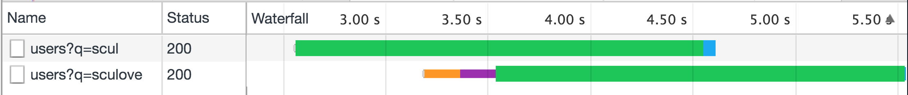
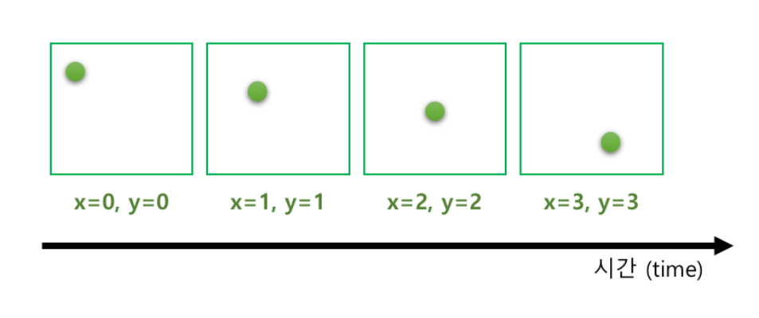

## rxjs란?

RxJS is a library for composing asynchronous and event-based programs by using observable sequences.


<small>출처: http://reactivex.io/rxjs/manual/overview.html</small>

-----

### 실습 Playground

CodeSandbox.io
https://codesandbox.io/s/rk2zo054q

Github
https://github.com/sculove/rxjs-book/blob/master/part2/01.rxjs/example.html

-----

### 비동기 예제


```js
import { fromEvent } from rxjs;
import { map } from rxjs.operators;
// 1. observable 생성
const currentTarget$ = fromEvent(document, "click");

// 2. pipe 연결
.pipe( 
  map(event => event.currentTarget) // 3. operator 적용 (map or pluck)
);

// 4. observer 생성
const observer = currentTarget => {
  console.log(currentTarget);
};
currentTarget$.subscribe(observer); // 5. Observable subscribe 하기
```

<small>pipe: <a href="http://reactivex.io/rxjs/class/es6/Observable.js~Observable.html#instance-method-pipe" target="_blank">V5.x</a>, <a href="https://rxjs-dev.firebaseapp.com/api/index/pipe" target="_blank">V6.x</a>,</small>
<small>map: <a href="http://reactivex.io/rxjs/class/es6/Observable.js~Observable.html#instance-method-map" target="_blank">V5.x</a>, <a href="https://rxjs-dev.firebaseapp.com/api/operators/map" target="_blank">V6.x</a>, <a href="http://rxmarbles.com/#map" target="_blank">rxmarble</a></small>
<small>pluck: <a href="http://reactivex.io/rxjs/class/es6/Observable.js~Observable.html#instance-method-pluck" target="_blank">V5.x</a>, <a href="https://rxjs-dev.firebaseapp.com/api/operators/pluck" target="_blank">V6.x</a>, <a href="http://rxmarbles.com/#pluck" target="_blank">rxmarble</a></small>

-----

### 동기 예제

```js
import { from } from rxjs;
import { filter } from rxjs.operators;
// 1. observable 생성
const users$ = from(users);

// 2. pipe 연결
.pipe(
  filter(user => user.nationality === "촉") // 3. operator 적용
);

// 4. observer 생성
const observer = user => {
  console.log(user);
};
users$.subscribe(observer); // 5. Observable subscribe 하기
```

<small>filter: <a href="http://reactivex.io/rxjs/class/es6/Observable.js~Observable.html#static-method-filter" target="_blank">V5.x</a>, <a href="https://rxjs-dev.firebaseapp.com/api/index/filter" target="_blank">V6.x</a>, <a href="http://rxmarbles.com/#filter" target="_blank">rxmarble</a></small>

-----

### 합치는 예제

```js
import { fromEvent, from, merge } from rxjs;
import { map, filter } from rxjs.operators;

// ...
const observer = merged => {
  console.log(merged);
};

// Observable 조합
merge(users$, currentTarget$).subscribe(observer);
```
<small>merge: <a href="http://reactivex.io/rxjs/class/es6/Observable.js~Observable.html#static-method-merge" target="_blank">V5.x</a>, <a href="https://rxjs-dev.firebaseapp.com/api/index/merge" target="_blank">V6.x</a>, <a href="http://rxmarbles.com/#merge" target="_blank">rxmarble</a></small>

-----

### RxJS 6대 천왕
RxJS에서는 다루는 중요 개념은 다음과 같다.

- Observable
- Operator
- Observer
- Subscription
- <strong class="grey">Subject</strong>
- <strong class="grey">Scheduler</strong>

-----

### 1. <a href="https://rxjs-dev.firebaseapp.com/api/index/Observable" target="_blank">Observable</a>
시간을 축으로 연속적인 데이터를 저장하는 컬렉션 <strong class="yellow">Stream</strong>

- pipe, subscribe method가 존재


```js
const users$ = from(users);
const currentTarget$ = fromEvent(document, "click");
merge(user$, currentTarget$);
```

-----

### 2. Operator

- Observable Composition (생성, 연결, 분리, 합침, 등)
- Immutable Observable 인스턴스를 반환
- RxJS에서 <strong>어휘</strong>와 같은 존재

```js
pipe( 
  map(event => event.currentTarget),
  filter(user => user.nationality === "촉")
);

merge(user$, currentTarget$);
```

-----


-----

### 3. Observer
Observable에 의해 전달된 데이터를 소비하는 주체

```js
const observer = {
 next: x => {
   console.log("Observer가 Observable로부터 받은 데이터: " + x)
 },
 error: err => {
   console.error("Observer가 Observable로부터 받은 에러 데이터: " + err)
 },
 complete: () => {
   console.log("Observer가 Observable로부터 종료 되었다는 알림을 받은 경우")
 },
};
```

-----

### 4. Subscription
Observable.prototype.subscribe의 반환값 
- Subscription 객체는 자원의 해제를 담당


```js
const sub1 = currentTarget$.subscribe(observer);
const sub2 = users$.subscribe(observer);

sub1.unsubscribe();
sub2.unsubscribe();
```

-----

### RxJS 개발 플로우
<ul>
  <li><strong>요구사항 파악</strong>시 흐름을 구성</li>
  <li class="fragment">데이터 소스를 <strong class="yellow">Observable로 변경</strong>
    <ul>
      <li>데이터를 변경하거나 추출, Observable composition</li>
    </ul>
  </li>
  <li class="fragment">operator로 <strong class="yellow">조작</strong></li>
  <li class="fragment">원하는 데이터를 받아 처리하는 Observer 생성</li>
  <li class="fragment">Observable의 subscribe를 통해 <em>Observer를 등록</em></li>
  <li class="fragment">Subscription으로 <em>구독 해지</em></li>
</ul>

-----


-----

<!-- .slide:data-background="#e7ad52" -->
## Observable 만들기 <<실습>>

https://codesandbox.io/s/kkwn1zq2kr

-----

### 데이터 처리
<strong>new Observable</strong> === Observable.create

```js
const { Observable } = rxjs;
const numbers$ = new Observable(function subscribe(observer) {
  observer.next(1);
  observer.next(2);
  observer.next(3);    
});
numbers$.subscribe(v => console.log(v));
```
<small>https://github.com/sculove/rxjs-book/blob/master/part2/02.create/create-1.html</small>

-----

### 에러 처리
```js
const { Observable } = rxjs;
const numbers$ = new Observable(function subscribe(observer) {
  try {
    observer.next(1);
    observer.next(2);
    // 에러가 발생한다면? 
    throw new Error("데이터 전달 도중 에러가 발생했습니다");
    observer.next(3);    
  } catch(e) {
    observer.error(e);
  }
});
numbers$.subscribe({
  next: v => console.log(v),
  error: e => console.error(e)
});
```
<small>https://github.com/sculove/rxjs-book/blob/master/part2/02.create/create-2.html</small>

-----

### 종료 처리
```js
const { Observable } = rxjs;
const numbers$ = new Observable(function subscribe(observer) {
  try {
    observer.next(1);
    observer.next(2);
    observer.next(3);    
    observer.complete();
  } catch(e) {
    observer.error(e);
  }
});
numbers$.subscribe({
  next: v => console.log(v),
  error: e => console.error(e),
  complete: () => console.log("데이터 전달 완료")
});
```

<small>https://github.com/sculove/rxjs-book/blob/master/part2/02.create/create-3.html</small>

-----

### 자원 해지
```js
const { Observable } = rxjs;
const interval$ = new Observable(function subscribe(observer) {
  const id = setInterval(function () {
    observer.next(new Date().toString());
  }, 1000);
  return function() { // 자원을 해제하는 함수
    console.log("interval 제거");    
    clearInterval(id);
  };
});
const subscription = interval$.subscribe(v => console.log(v));

// 5초 후 구독을 해제한다.
setTimeout(function () {
  subscription.unsubscribe();  
}, 5000);
```

<small>https://github.com/sculove/rxjs-book/blob/master/part2/02.create/create-4.html</small>

-----

<a href="https://rxjs-dev.firebaseapp.com/api/index" target="_blank">rxjs 네임스페이스에 유틸성 생성 함수</a> 제공

- of
- range
- interval
- from
- fromEvent
- empty
- throwError
- never
- ...

<small>가급적 Observable을 생성할 때는 rxjs 네임스페이스에서 제공하는 생성 함수를 이용하여 사용하자.</small>

-----

<!-- .slide:data-background="#e7ad52" -->
## 함수 VS Observable

-----

### 함수의 특징

- <strong>정의</strong> 후 <strong>사용</strong>한다.  
- 함수의 정의부가 <strong class="yellow">매번 호출하여 동일한 값</strong>을 얻는다.

```js
// 정의
function foo(value) {
  console.log(`I'am function ${value}`);
  return value + 1;
}

// 사용
foo(100); // I'am function 100
foo(100); // I'am function 100
```

-----

데이터가 올 때까지 기다렸다가 호출할 수 있다 <strong>Lazy</strong>

<pre><code data-trim data-noescape>
const xhr = new XMLHttpRequest();
xhr.onload = function(e) {
  afterAjaxResult = JSON.parse(xhr.responseText);

  const result = <mark>foo(afterAjaxResult);</mark>
  console.log(result);
}
</code></pre>

-----

### Obseravable <<실습>>

- Observable <strong>생성</strong> 후 <strong>구독(subscribe)</strong>한다.
- <em>Lazy</em> 하다.

```js
const { interval } = rxjs;
// 정의
const numbers$ = interval(1000);

// 사용: subscribe가 호출되는 순간부터 데이터가 전달된다.
numbers$.subscribe(value => console.log(value));
```

-----

함수의 정의부가 <strong class="yellow">매번 호출하여 동일한 값</strong>을 얻는다.

<pre><code data-trim data-noescape>
const { interval } = rxjs;
// 정의
const numbers$ = interval(1000);

// 사용: subscribe가 호출되는 순간부터 데이터가 전달된다.
numbers$.subscribe(value => console.log(value));

<mark>setTimeout(() => {
  // 또 사용
  numbers$.subscribe(value => console.log(`두번째 ${value}`)));
}, 2000);</mark>
</code></pre>

-----

### 차이점은?
- 함수는 <strong class="yellow">단 건 결과</strong>
- Observable은 <strong class="yellow">다건 결과</strong>
- 함수는 <em>someone</em>이 호출 할때 데이터가 전달 <strong>Pull 방식</strong>
- Observable는 <em>Observable</em>이 데이터를 전달 <strong>Push 방식</strong>

-----

## Pull VS Push


- Pull: <strong>수동</strong> 데이터는 있을 수도 없을 수도
- Push: <strong>자동</strong> 데이터는 항상 있다. <strong class="yellow">거부권</strong>

-----


<!-- .slide:data-background="#e7ad52" -->
## Promise VS Observable

-----

### Promise의 특징

- Promise <strong>생성</strong> 후 <strong>구독(then)</strong>한다.  
- <strong class="yellow">Push 방식</strong>으로 데이터가 전달된다.

```js
// 정의
const promise = new Promise((resolve, reject) => {
  try {
    resolve(1);
  } catch(e) {
    reject("error promise");
  }
});

// 사용
promise.then(
  value => console.log(`promise ${value}`),
  error => console.error(`promise ${error}`)
);
```

-----

### 차이점은?

#### Lazy 한 것 처럼 보이지만... 아니다.
정의부가 딱 1번 호출된다.

- Promise   <small>https://github.com/sculove/rxjs-book/blob/master/part2/03.observable/04.promise-lazy.html</small>
- Observable <small>https://github.com/sculove/rxjs-book/blob/master/part2/03.observable/05.observable-lazy.html</small>

-----

#### Cancellation
Promise는 취소에 대한 인터페이스가 없다.

- Promise <small>https://github.com/sculove/rxjs-book/blob/master/part2/03.observable/06.promise-cancel.html</small>
- Observable <small>https://github.com/sculove/rxjs-book/blob/master/part2/03.observable/07.observable-cancel.html</small>

-----

## 함수 VS Observable VS Promise


-----

<!-- .slide:data-background="#1A3819" -->
## Marble Diagram
데이터의 흐름을 표현하는 다이어그램

-----

</img>

-----

<!-- .slide:data-background="#e7ad52" -->
# 자동완성 만들기

https://codesandbox.io/s/znrlxn6knx

-----


-----

### 입력 창
```html
<input id="search" type="input" 
  placeholder="검색하고 싶은 사용자 아이디를 입력해주세요">
</input>
```

- keyup$: 사용자의 키입력 처리 (keyup 이벤트)
- 전달되는 값을 바꾸고 싶어요: event => event.target.value

-----

### 사용자 데이터 받기 (from 서버)

- request$: fetch => from => rxjs.ajax.ajax.getJSON

<small>URL: https://api.github.com/search/users?q=사용자명</small>

-----

### keyup$과 request$ 합치기

- user$: keyup$ => request$

-----

### Observable of Observables

배열의 배열 꼴


-----

### Flatten


<small>mergeAll: <a href="http://reactivex.io/rxjs/class/es6/Observable.js~Observable.html#instance-method-mergeAll" target="_blank">V5.x</a>, <a href="https://rxjs-dev.firebaseapp.com/api/operators/mergeAll" target="_blank">V6.x</a>,</small>
<small>merge: <a href="http://reactivex.io/rxjs/class/es6/Observable.js~Observable.html#static-method-merge" target="_blank">V5.x</a>, <a href="https://rxjs-dev.firebaseapp.com/api/index/merge" target="_blank">V6.x</a>, <a href="http://rxmarbles.com/#merge" target="_blank">rxmarble</a></small>
<small>mergeMap: <a href="http://reactivex.io/rxjs/class/es6/Observable.js~Observable.html#instance-method-mergeMap" target="_blank">V5.x</a>, <a href="https://rxjs-dev.firebaseapp.com/api/operators/mergeMap" target="_blank">V6.x</a>, <a href="http://rxmarbles.com/#mergeMap" target="_blank">rxmarble</a></small>
<small>flatMap: <a href="https://rxjs-dev.firebaseapp.com/api/operators/flatMap" target="_blank">V6.x</a></small>

-----

### 403 Forbidden 에러 처리: 빈번한 요청은 안 돼요


-----

키입력 이후에 debounceTime (map 앞에)

- debounce: 마지막 요청만 한번
- throttle: 설정 시간내 딱 한번

<small>debounceTime: <a href="http://reactivex.io/rxjs/class/es6/Observable.js~Observable.html#instance-method-debounceTime" target="_blank">V5.x</a>, <a href="https://rxjs-dev.firebaseapp.com/api/operators/debounceTime" target="_blank">V6.x</a>, <a href="http://rxmarbles.com/#debounceTime">rxmarble</a></small>

-----

### 빈 검색어, 특수키가 입력되는 경우에는요?
- filter 적용 (value.trim().length > 0)
- filter 앞에서 distinctUntilChanged 적용

<small>distinctUnilChanged: <a href="http://reactivex.io/rxjs/class/es6/Observable.js~Observable.html#instance-method-distinctUntilChanged" target="_blank">V5.x</a>, <a href="https://rxjs-dev.firebaseapp.com/api/operators/distinctUntilChanged" target="_blank">V6.x</a>, <a href="http://rxmarbles.com/#distinctUntilChanged">rxmarble</a></small>

-----

### 검색결과 표현하기

- drawLayer(items);

-----

### 주의. Github API 정책

- 기본 1분당 10회
- 인증된 Request의 경우에는 1분당 30회


<small>https://developer.github.com/v3/search/#rate-limit</small>
<small><a href="https://github.com/settings/tokens">github token</a></small>

-----

### github 인증 분당 30분으로


- ajax.getJSON => <strong>ajax + map(ajax => ajax.response)</strong>
<small><a href="https://rxjs-dev.firebaseapp.com/api/ajax/ajax">https://rxjs-dev.firebaseapp.com/api/ajax/ajax</small>

```js
ajax({
  url: `https://api.github.com/search/users?q=${query}`,
  method: "GET",
  headers: {
    Authorization: "token GITHUB인증"
  }
})
```

-----

### 로딩바 띄우기

- ajax 요청하기 전에 로딩바 띄우기, 후에 로딩바 닫기

<small>tap : <a href="http://reactivex.io/rxjs/function/index.html#static-function-tap" target="_blank">V5.x (do)</a>, <a href="https://rxjs-dev.firebaseapp.com/api/operators/tap" target="_blank">V6.x</a></small>

-----

### 검색결과가 지워졌을 경우
- filter(value => value.length > 0) 부분 reset$으로 분리하기
- reset$에서 검색결과 초기화하기 ($layer.innerHTML = "")

<small>partition : <a href="http://reactivex.io/rxjs/class/es6/Observable.js~Observable.html#instance-method-partition" target="_blank">V5.x</a>, <a href="https://rxjs-dev.firebaseapp.com/api/operators/partition" target="_blank">V6.x</a></small>

-----

### 얼라리... 검색결과가 지워져도 초기화가 안된다.


-----

### 열악한 네트워크 환경



- map + mergeAll => map + swithAll 
- mergeMap => switchMap

<small>switchAll : <a href="http://reactivex.io/rxjs/class/es6/Observable.js~Observable.html#instance-method-switch" target="_blank">V5.x (switch)</a>, <a href="https://rxjs-dev.firebaseapp.com/api/operators/switchAll" target="_blank">V6.x</a>, </small>
<small>switchMap: <a href="http://reactivex.io/rxjs/class/es6/Observable.js~Observable.html#instance-method-switchMap" target="_blank">V5.x</a>, <a href="https://rxjs-dev.firebaseapp.com/api/operators/switchMap" target="_blank">V6.x</a>, <a href="http://rxmarbles.com/#switchMap" target="_blank">rxmarble</a></small>


-----

### 서버 에러시 에러처리 (네트워크 중단)

- offline시 error 확인
- error시 error후 complete 처리됨. catchError((e, org) => org)
- retry(1)
- finalize시 로딩바 닫기 (종료나 에러시에만 호출)

<small>catchError : <a href="http://reactivex.io/rxjs/class/es6/Observable.js~Observable.html#instance-method-catch" target="_blank">V5.x (catch)</a>, <a href="https://rxjs-dev.firebaseapp.com/api/operators/catchError" target="_blank">V6.x</a>, </small>
<small>retry : <a href="http://reactivex.io/rxjs/class/es6/Observable.js~Observable.html#instance-method-retry" target="_blank">V5.x</a>, <a href="https://rxjs-dev.firebaseapp.com/api/operators/retry" target="_blank">V6.x</a>, </small>
<small>finalize : <a href="http://reactivex.io/rxjs/class/es6/Observable.js~Observable.html#instance-method-finalize" target="_blank">V5.x (finally)</a>, <a href="https://rxjs-dev.firebaseapp.com/api/operators/retry" target="_blank">V6.x</a> </small>

-----

### 사소한 문제점. 중복호출
마지막에서 tap으로 데이터 확인하기. keyup이 두번?


-----

<!-- .slide:data-background="#e7ad52" -->
### Cold Observable과 Hot Observable

-----

#### Cold Observable
Observable <strong>내부</strong>에서 socket 생성

<pre><code data-trim data-noescape>
const { Observable } = rxjs;
const coldWebsocket$ = new Observable(function subscribe(observer) {
  // Observable 내부에서 생성
  <mark>const socket = new WebSocket("ws://someurl");</mark>
  const handler = (e) => observer.next(e);
    socket.addEventListener("message", handler);
    return () => socket.close();
  }
);
</code></pre>

-----

#### Hot Observable
Observable <strong>외부</strong>에서 socket 생성

<pre><code data-trim data-noescape>
const { Observable } = rxjs;
// Observable 외부에서 생성
<mark>const socket = new WebSocket("ws://someurl");</mark>

const hotWebsocket$ = new Observable(function subscribe(observer) {
  const handler = (e) => observer.next(e);
  socket.addEventListener("message", handler);
    return socket.removeEventListener("messge", handler);
  }
);
</code></pre>

-----

### 데이터 제공자가 
Observable <strong>내부</strong>에서 만들어졌으면 Cold  
<strong>외부</strong>에서 만들어 졌으면 Hot

- 내부: subscribe시 매번 새로 만듦. Observer가 <strong class="yellow">독립적</strong>
- 외부: 한 번만 만듦. Observer들과 <strong class="yellow">공유</strong>

-----

## Cold와 Hot Observable 비교


-----

## <a href="https://rxjs-dev.firebaseapp.com/api/index/Subject" target="_blank">Subject</a>
- Subject는 <strong>읽기 쓰기(write-read)</strong>가 가능한 Observable
- 기능면에서 <em>Observer pattern과 완전 동일</em>

```js
const { Subject } = rxjs;
const subject = new Subject();

// observerA를 등록
subject.subscribe({
  next: (v) => console.log(`observerA: ${v}`)
});
// 데이터 1을 전달
subject.next(1);

// observerB를 등록
subject.subscribe({
  next: (v) => console.log(`observerB: ${v}`)
});
// 데이터 2를 전달
subject.next(2);
```
<small>https://github.com/sculove/rxjs-book/blob/master/part2/04.autocomplete/subject.html</small>

-----

### Event Bus


-----

### 자 그럼 우리는 어떻게 만들까?
subject에서 user$와 reset$ 생성 후
```js
keyup$.subscribe(subject);
```


-----

### 데이터 공유가 까다롭네?
사전에 공유할 Observable과 observer들을 연결해야함.


-----

### ConnectableObservable
- <em>multicat</em>로 conectableObservable을 만들 수 있다.
- <strong class="yellow">connect 메소드</strong>를 통해 데이터 전달 시점을 제어할 수 있다.

<small>multicast : <a href="http://reactivex.io/rxjs/class/es6/Observable.js~Observable.html#instance-method-multicast" target="_blank">V5.x</a>, <a href="https://rxjs-dev.firebaseapp.com/api/operators/multicast" target="_blank">V6.x</a>, </small>
<small>publish : <a href="http://reactivex.io/rxjs/class/es6/Observable.js~Observable.html#instance-method-publish" target="_blank">V5.x</a>, <a href="https://rxjs-dev.firebaseapp.com/api/operators/publish" target="_blank">V6.x</a> </small>

-----

### connectableObservable 자원해제
observer가 다 구독해제 되면  
connectableObservable도 subscribe 해야한다.

<small>https://github.com/sculove/rxjs-book/blob/master/part2/04.autocomplete/connetableObservable-unsubscribe.html</small>

-----

#### refCount
- 첫번째 구독시 <strong class="yellow">자동 connect</strong>
- 마지막 구독이 unsubscribe 되면   
<strong class="yellow">자동으로</strong> ConnectableObservable도 unsubscribe
- 반환값 <em>Observable</em>

<small>refCount : <a href="https://rxjs-dev.firebaseapp.com/api/operators/refCount" target="_blank">V6.x</a>, </small>
<small>share : <a href="http://reactivex.io/rxjs/class/es6/Observable.js~Observable.html#instance-method-share" target="_blank">V5.x</a>, <a href="https://rxjs-dev.firebaseapp.com/api/operators/share" target="_blank">V6.x</a> </small>

-----


-----

## 다양한 Subject
Why? 구독 시점에 따라 예전 데이터를 못 얻으니깐...

- <a href="https://rxjs-dev.firebaseapp.com/api/index/BehaviorSubject" target="_blank">BehaviorSubject</a> <small>https://github.com/sculove/rxjs-book/blob/master/part2/XX.subject/behaviorSubject.html</small>
- <a href="https://rxjs-dev.firebaseapp.com/api/index/ReplaySubject" target="_blank">ReplaySubject</a>
<small>https://github.com/sculove/rxjs-book/blob/master/part2/XX.subject/replaySubject.html</small>
- <a href="https://rxjs-dev.firebaseapp.com/api/index/AsyncSubject" target="_blank">AsyncSubject</a>
<small>https://github.com/sculove/rxjs-book/blob/master/part2/XX.subject/asyncSubject.html</small>

-----

### 어휘 UP
- multicast(new Subject()): <strong class="yellow">publish</strong>
- multicast(new BehaviorSubject(value)): <strong class="yellow">publishBehavior(value)</strong>
- multicast(new ReplaySubject(bufferSize, windowTime)): <strong class="yellow">publishReplay(bufferSize, windowTime)</strong>
- multicast(new AsyncSubject()): <strong class="yellow">publishLast()</strong>

-----

### 어휘 UUP
- publish() + refCount(): <strong class="yellow">share()</strong>
- publishReplay(bufferSize, windowTime) + refCount(): <strong class="yellow">shareReplay(bufferSize, windowTime)</strong>

-----

<!-- .slide:data-background="#e7ad52" -->
# Scheduler와 
# 애니메이션 만들기

-----

## Scheduler
스케줄러의 사전적 의미.   
<strong class="yellow">앞으로 해야 할 모든 일들을 조절하는 사람</strong>

-----

## RxJS의 Scheduler는?

Observable가 전달되는 데이터나 Observer가 받는   
<strong class="yellow">데이터 처리 시점을 조절</strong>하는 일

자바스크립트의 스케줄러가 하는 일을  
<em>RxJS에서 효과적으로 처리하기 위해서 만든 가상의 스케줄러</em>


-----

## JavaScript 스케쥴러는?

- setTimeout/setInterval: <strong class="yellow">Task queue</strong>에서 처리
- promise : <strong class="yellow">microtask queue</strong>에서 처리
- requestAnimationFrame : <strong class="yellow">AnimationFrame</strong> 에서 처리

-----


-----

### 다양한 RxJS Scheduler

- asyncScheduler: <strong class="yellow">task</strong>에 등록하는 스케줄러
- asapScheduler: <strong class="yellow">microtask</strong>에 등록하는 스케줄러
- animationFrameScheduler : <strong class="yellow">requestAnimation</strong>과 동일. animation frame에 등록하는 스케쥴러
- null: 스택에 등록하는 스케줄러. <strong>동기식</strong> <strong class="yellow">기본 스케쥴러</strong>

-----

### 사실은 지금까지 쓰고 있었던 스케줄러
Observable 생성 함수에서
```js
from(ish: ObservableInput<T>, scheduler: Scheduler)
of(values: ...T, scheduler: Scheduler)
interval(period: number, scheduler: Scheduler)
throwError(error: any, scheduler: Scheduler)
...
```

-----


### subscribeOn, observeOn
operator에서 

- <a href="http://reactivex.io/rxjs/class/es6/Observable.js~Observable.html#instance-method-subscribeOn" target="_blank">subscribeOn</a>
<small>https://github.com/sculove/rxjs-book/blob/master/part2/04.carousel/asyncScheduler-1.html</small>
- <a href="http://reactivex.io/rxjs/class/es6/Observable.js~Observable.html#instance-method-observeOn" target="_blank">observeOn</a>
<small>https://github.com/sculove/rxjs-book/blob/master/part2/04.carousel/asyncScheduler-2.html</small>

-----



-----


-----

## Animation Observable 만들기

```js
const { animationFrame, interval } = rxjs;

const scheduler = animationFrame;
const animation$ = interval(0, scheduler);
```
<small>https://github.com/sculove/rxjs-book/blob/master/part2/05.carousel/animation.html</small>

-----

### 애니메이션 구하는 공식
- 이동거리 비율 구하기: 경과시간/총 애니메이션 이동시간
- = (현재 시간 - 애니메이션 시작 시간) / 총 애니메이션 이동시간

-----

```js
const { animationFrameScheduler, interval } = rxjs;
const { map } = rxjs.operators;

const scheduler = animationFrameScheduler;
const start = scheduler.now();  // 시작하는 가상의 시간을 구할수 있음
const DURATION = 300;
const animation$ = interval(0, scheduler)
.pipe(
  map(() => (scheduler.now() - start) / DURATION)
);

animation$.subscribe(rate => console.log("animation$", rate));
```

-----

- takeWhile로 0 ~ 1 사이의 값 구하기. (rate <= 1)
- concat으로 1 합치기
- 위치 구하기: 현재위치 + (현재위치로부터 이동한 거리 * 이동거리의 비율) 

<small>takeWhile: <a href="http://reactivex.io/rxjs/class/es6/Observable.js~Observable.html#instance-method-takeWhile" target="_blank">V5.x</a>, <a href="https://rxjs-dev.firebaseapp.com/api/operators/takeWhile" target="_blank">V6.x</a>, <a href="http://rxmarbles.com/#takeWhile" target="_blank">rxmarble</a>, </small>
<small>concat: <a href="http://reactivex.io/rxjs/class/es6/Observable.js~Observable.html#static-method-concat" target="_blank">V5.x</a>, <a href="https://rxjs-dev.firebaseapp.com/api/index/concat" target="_blank">V6.x</a>, <a href="http://rxmarbles.com/#concat" target="_blank">rxmarble</a></small>

-----

```js
function animation(from, to, duration) {
  const scheduler = animationFrameScheduler;
  const start = scheduler.now();
  const interval$ = interval(0, scheduler)
      .pipe( 
          map(() => (scheduler.now() - start) / duration),
          takeWhile(rate => rate < 1) 
      );
  return concat(interval$, of(1))
      .pipe(
          map(rate => from + (to - from) * rate)
      );
}
// 애니메이션 데이터 호출 
const animation$ = animation(100, 500, 300);
animation$.subscribe(v => console.log(v));
```

-----

```js
// 애니메이션 데이터 호출 
const animation$ = animation(100, 500, 300);

setTimeout(() => {
  animation$.subscribe(v => console.log(v));
}, 500);
```

- defer로 animation$ 선언부와 subscribe 분리하기.
- 박스에 애니메이션 적용하기 ($box.style.y)

<small>defer: <a href="http://reactivex.io/rxjs/class/es6/Observable.js~Observable.html#static-method-defer" target="_blank">V5.x</a>, <a href="https://rxjs-dev.firebaseapp.com/api/index/defer" target="_blank">V6.x</a></small>

-----

```js
const $box = document.getElementById("box");
const { 
  animationFrameScheduler, 
  interval, 
  defer, 
  concat, 
  of 
} = rxjs;
const { map, takeWhile } = rxjs.operators;

function animation(from, to, duration) {
    return defer(() => {
    const scheduler = animationFrameScheduler;
    const start = scheduler.now();
    const interval$ = interval(0, scheduler)
        .pipe( 
            map(() => (scheduler.now() - start) / duration),
            takeWhile(rate => rate < 1) 
        );
    return concat(interval$, of(1))
        .pipe(
            map(rate => from + (to - from) * rate)
        );
    });
}

const animation$ = animation(100, 500, 3000);
animation$.subscribe(y => $box.style.top = `${y}px`);
```

-----

<!-- .slide:data-background="#e7ad52" -->
## Advance 과정이 있다면...

-----

### 플리킹 만들기
- https://github.com/sculove/rxjs-book/tree/master/part2/05.carousel


-----

### 버스노선 서비스 만들기
- https://github.com/sculove/rxjs-book-example


-----

### 버스노선 서비스 - 데이터 흐름


-----

### 그 외...
- RxJS와 프레임워크
- RxJS 테스팅과 디버깅
- Observable를 이용한 OOP와 FP 설계

-----

### RxJS 관련 좋은 사이트
- <a href="http://reactive.how/rxjs/explorer" targe="_blank">RxJS Explorer: 버전별 비교</a>
- <a href="http://reactivex.io/rxjs/manual/overview.html#choose-an-operator" targe="_blank">원하는 operator 고르기</a>
- <a href="http://reactive.how/" targe="_blank">Reactive.how 그림으로 배우는 operator</a>
- <a href="https://rxviz.com/" targe="_blank">Animated playground for Rx Observables</a>
- <a href="https://legacy.gitbook.com/book/btroncone/learn-rxjs" targe="_blank">learn-rxjs</a>

