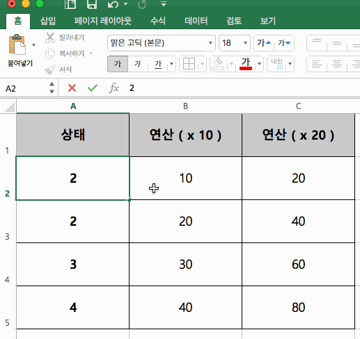

## RxJS (ReactiveX for JavaScript)

Microsoft가 만든 ReactiveX의 JavaScript 버전 라이브러리

- 2007년 MS Volta
- 2009년 ReactiveX(Reactive Extentions) for .NET/Silverlight
- <strong class="yellow">2010년 RxJS</strong>
- 2012년 Rx.NET, RxJS, Rx++을 오픈소스로 오픈

<small><a href="http://huns.me/development/2051" target="_blank">참고. MS는 ReactiveX를 왜 만들었을까?</a></small>

-----

### Reactive Programing


<br>


-----

### Android 에서 Rx는 필수지


-----

## FrontEnd는 
<strong class="yellow">RxJS</strong>가 있자너...

-----

난 <strong class="bigsize">트랜드</strong>에 뒤쳐질 수 없지


-----

내가 RxJS 해봐서 아는데
<strong class="yellow bigsize">비동기 처리</strong> 잘하는 라이브러리야.


-----

### 비동기 처리
- Callback  
- Promise 
- Generator
- Async/Await <!-- .element: class="fragment yellow" --> 

<h2 class="fragment">심지어 <strong>표준</strong>인데</h2>
<h4 class="fragment"><small><a href="https://github.com/tc39/proposals/blob/master/stage-1-proposals.md">2019년 12월 기준 Observable은 stage 1단계</a></small></h4>

-----

<!-- .slide: data-background="#000000" -->
RxJS 용어 절라 <strong class="yellow bigsize">어려워요</strong>


-----

### 그걸 왜 쓰냐?


-----


-----

### RxJS가 담당하는 영역

## 비동기 처리 <!-- .element: class="yellow" -->
## 데이터 전파 <!-- .element: class="fragment yellow" -->
## 데이터 처리 <!-- .element: class="fragment yellow" -->

-----

# RxJS는 
<h2 class="fragment"><strong class="yellow">일관된 방식</strong>으로</h1>
<h2 class="fragment"><strong class="green">안전</strong>하게</h1>
<h2 class="fragment"><strong>데이터 흐름</strong>을</h1>
<h2 class="fragment"><strong class="blue">처리</strong>하는</h1>
## 라이브러리 이다.

-----

## 이게 무슨 말이냐면?


-----

요즘 웹은 예전과 달라요. 복잡해졌어요.


-----

#### 모든 어플리케이션은 
## 궁극적으로 __상태머신__이다.


-----

### 상태 머신

1. 시스템으로 input이 발생한다.
2. 프로그램 로직은 input과 현재 프로그램 상태에 따라 행위를 결정한다.
3. 프로그램 로직은 결정에 따라, 프로그램 상태를 변경한다.
4. 경우에 따라서는 프로그램 로직은 output을 생산하기도 한다.

-----

### 레이어 토글링 기능 예제
1. 사용자가 버튼을 누른다.
2. 웹어플리케이션은 현재 레이어가 닫혀있는 상태인지? 아니면 열려있는 상태인지에 따라 레이어를 열지 아니면 레이어를 닫을지를 결정한다.
3. 레이어가 열려있다면 레이어를 닫는 상태로 바꿔주고, 레이어가 닫혀있다면 레이어를 열려있는 상태로 변경한다.
4. 레이어의 DOM에 상태를 적용한다.

-----

### 언제 오류가 나느냐? - <strong class="yellow">입력값</strong>
- 입력된 값/타입을 잘못 전달한 경우
- 입력된 값이 명확하지 않은 경우
- 입력된 값을 준비되지 않은 상태에서 전달한 경우

-----

#### 개발자가 처리하는 
## <strong>입력값(Input)</strong>은 어떤 것들이 있는가?  
<p class="fragment">
  <strong class="green ">배열 데이터</strong>도 입력값으로  
  <strong class="green ">함수 반환값 </strong>도 입력값으로
</p>
<p class="fragment">
  <strong class="yellow ">키보드를 누르는 것</strong>도 입력값으로  
  <strong class="yellow ">마우스를 움직이는 것</strong>도 입력값으로
</p>
<p class="fragment">
  <strong class="blue ">원격지의 데이터</strong>도 입력값으로  
  <strong class="blue ">DB 데이터</strong>도 입력값으로
</p>
<p class="fragment">...</p>

-----

## 개발자의 고민

어떤 것은 <strong class="yellow">동기 (Synchronous)</strong>  
어떤 것은 <strong>비동기 (Asynchronous)</strong>

아우~ 브라우저가 동기,비동기 섞어서 주네

<small>어떻게 섞어서 주는지 궁금하면 <a href="http://sculove.github.io/blog/2018/01/18/javascriptflow/" target="_blank">클릭</a></small>

-----

## 개발자의 고민

<p>
어떤 것은 <strong class="yellow">함수 호출(Call)</strong>  
어떤 것은 <strong >이벤트(Event)</strong>  
어떤 것은 <strong class="grey">Callback</strong>  
어떤 것은 <strong class="green">Promise</strong>
</p>

<h3 class="fragment blue">각각에 따라 처리해야한다.</h3>

-----

<div class="data-container">
  <div style="float:left; margin-right:100px">배열 데이터를 처리하는 경우</div>
  <div class="data back-yellow fragment">arr[0]</div>
  <div class="data back-yellow fragment">arr[1]</div>
  <div class="data back-yellow fragment">arr[2]</div>
</div>
<br>
<div class="data-container">
  <div style="float:left; margin-right:100px">함수를 호출한 경우</div>
  <div class="data back-grey fragment">call</div>
  <div class="data back-grey fragment">call</div>
  <div class="data back-grey fragment">call</div>
</div>
<br>
<div class="data-container">
  <div style="float:left; margin-right:100px">마우스를 클릭하는 경우</div>
  <div class="data fragment" style="margin-right:50px">click</div>
  <div class="data fragment" style="margin-right:100px">click</div>
  <div class="data fragment">click</div>
</div>
<br>
<div class="data-container">
  <div style="float:left; margin-right:100px">Ajax를 호출한 경우</div>
  <div class="data back-blue fragment" style="width:150px;margin-right:100px">request</div>
  <div class="data back-blue fragment" style="width:150px">response</div>
</div>

-----


<div class="data-container">
  <div style="float:left; margin-right:100px">배열 데이터를 처리하는 경우</div>
  
  <div class="yellow" style="float:left">[</div>
  <div class="data back-yellow">arr[0]</div>
  <div class="yellow" style="float:left">,</div>
  <div class="data back-yellow">arr[1]</div>
  <div class="yellow" style="float:left">,</div>
  <div class="data back-yellow">arr[2]</div>
  <div class="yellow" style="float:left">]</div>
</div>
<br>
<div class="data-container">
  <div style="float:left; margin-right:100px">함수를 호출한 경우</div>
  <div class="grey" style="float:left">[</div>
  <div class="data back-grey ">call</div>
  <div class="grey" style="float:left">,</div>
  <div class="data back-grey ">call</div>
  <div class="grey" style="float:left">,</div>
  <div class="data back-grey ">call</div>
  <div class="grey" style="float:left">]</div>
</div>
<br>
<div class="data-container">
  <div style="float:left; margin-right:100px">마우스를 클릭하는 경우</div>
  <div style="color:red; float:left">[</div>
  <div class="data " style="margin-right:50px">click</div>
  <div style="color:red; float:left">,</div>
  <div class="data " style="margin-right:100px">click</div>
  <div style="color:red; float:left">,</div>
  <div class="data ">click</div>
  <div style="color:red; float:left">]</div>
</div>
<br>
<div class="data-container">
  <div style="float:left; margin-right:100px">Ajax를 호출한 경우</div>
  <div class="blue" style="float:left">[</div>
  <div class="data back-blue " style="width:150px;margin-right:100px">request</div>
  <div class="blue" style="float:left">,</div>
  <div class="data back-blue " style="width:150px">response</div>
  <div class="blue" style="float:left">]</div>
</div>
<br><br>
<div>
  <div class="arrow"></div>
  <strong class="bigsize">TIME</strong>
</div>
<br>
<h3 class="fragment"> 시간축 관점에서 결국 <strong class="bigsize yellow">동기 === 비동기</strong></h3>

-----


### 하나의 방식으로 처리하자. 
### <strong class="yellow">인터페이스의 단일화</strong>

-----

## RxJS는...

<p style="text-decoration:line-through">
어떤 것은 <strong class="yellow">동기 (Synchronous)</strong>  
어떤 것은 <strong>비동기 (Asynchronous)</strong>  
어떤 것은 <strong class="yellow">함수 호출(Call)</strong>  
어떤 것은 <strong >이벤트(Event)</strong>  
어떤 것은 <strong class="grey">Callback</strong>  
어떤 것은 <strong class="green">Promise</strong>
</p>

<h3 class="fragment blue">모두 Observable로 처리한다</h3>

-----

#### 모든 어플리케이션은 
<h2 class="fragment red">궁극적으로 __상태머신__이다.</h2>
<div class="fragment">
<h2>궁극적으로 __상태머신의 집합__이다.</h2>


</div>

-----

### 언제 오류가 나느냐? - 상태 전파
- <strong class="yellow">의존 관계</strong>에 있는 구성요소들의 상태 변화를 함께 전달하지 않아서 발생하는 경우
- 구성요소 간의 <strong class="yellow">호출 순서</strong>에 의존도가 있는 경우에 구성요소의 호출 순서가 틀린 경우

-----

## 개발자의 고민
<strong class="yellow bigsize">의존관계가 있는 상태머신</strong>에게  
변경된 상태 정보를 <strong class="bigsize">어떻게 전달하지?</strong>


-----

## Reactive Programming

데이터 흐름과 상태 변화 전파에 중점을 둔 프로그램 패러다임이다.  사용되는 프로그래밍 언어에서 데이터 흐름을 쉽게 표현할 수 있어야하며 기본 실행 모델이 변경 사항을 <strong class="yellow bigsize">데이터 흐름</strong>을 통해 <strong class="bigsize">자동으로 전파한다</strong>는 것을 의미한다.

<small>출처 : <a href="https://en.wikipedia.org/wiki/Reactive_programming">https://en.wikipedia.org/wiki/Reactive_programming</a></small>

-----

### 대표적인 예. 엑셀


-----

## 이미 우리는 알고 있었다.
Observer pattern

-----

## Observer Pattern


Subject의 <strong class="blue">변경사항</strong>이 생기면 <strong>자동</strong>으로  
<strong class="yellow">Observer의 update를 호출한다.</strong> <strong class="yellow">(Loosely Coupling)</strong>

-----

## 실습

Observer 패턴을 구현해보자.

https://github.com/sculove/rxjs-book/blob/master/part1/02.state/observer-pattern.html

-----

## Observer 패턴 좋은데... 아쉽다

-----

### 문제점 1
NewsPaper의 구독이 중지된 경우, 에러가 발생한 경우
- NewsScrapper와 NewsReader에게 어떻게 알려주지?
- 또 정해야하나?

-----

### 문제점 2
NewsScrapper가 NewsPaper인 경우는 무한루프?

-----

### 문제점 3
구독 전에 다른 구독자에게 발송한 정보를 볼 수는 없나?

-----


### Observer Pattern을 <strong>고쳐서</strong> 적용하자.
#### <strong class="yellow">상태 자동전파. Loosely Coupling</strong>
#### <strong class="yellow">Read-only</strong>


-----


## RxJS는...
### 1. update => <strong class="yellow">next, error, complete</strong>


-----

### 2. 단방향의 데이터 흐름 (read-only)
Subject(Observable)은 바꿀 수 없다.

add, remove => <strong class="yellow">subscribe</strong>


-----


## 데이터를 받은 후에는 뭐하니?
<p class="fragment">데이터를 받은 후에 받은 데이터를 <strong class="bigsize">가공</strong>한다.</p>

-----

### 언제 오류가 나느냐? - 로직 처리
- <strong class="yellow">반복문, 조건문</strong>에 의해 로직 처리를 잘못한 경우.
-	로직의 연산을 잘못하여 발생하는 경우.
- <strong>변수값</strong>에 할당을 잘못한 경우.

-----


-----

#### 1. Ajax로 데이터를 받음.

<pre><code data-trim data-noescape>
const xhr = new XMLHttpRequest();
xhr.onreadystatechange = function() {
    if(xhr.readyState == 4 && xhr.status == 200) {
	const jsonData = JSON.parse(xhr.responseText);
        document.getElementById("users").innerHTML = 
          <mark>process(jsonData);</mark>
    }
};
xhr.open("GET", "https://swapi.co/api/people/?format=json");
xhr.send();
</code></pre>

-----

#### 2. 데이터를 가공함
process 함수

```js
// 데이터를 처리하는 함수
function process(people) {
    const html = [];
    for (const user of people.results) {
        if (/male|female/.test(user.gender)) {
	    let broca;
	    let bmi;
            if (user.gender == "male") {
		broca = (user.height - 100 * 0.9).toFixed(2);
		bmi = (user.height / 100 * user.height / 100 * 22).toFixed(2);
	    } else {
		broca = (user.height - 100 * 0.9).toFixed(2);
		bmi = (user.height / 100 * user.height / 100 * 21).toFixed(2);
	    }
	    const obesityUsingBroca = ((user.mass - broca) / broca * 100).toFixed(2);
	    const obesityUsingBmi = ((user.mass - bmi) / bmi * 100).toFixed(2);
			
	    html.push(`<li class='card'>
			  <dl>
			      <dt>${user.name} <i class="fa fa-${user.gender}"></i></dt>
			      <dd><span>키 : </span><span>${user.height} cm</span></dd>
			      <dd><span>몸무게: </span><span>${user.mass} kg</span></dd>
			      <dd><span>BROCA 표준체중 : </span><span>${broca} kg</span></dd>
			      <dd><span>BROCA 비만도 : ${obesityUsingBroca}</span></dd>
			      <dd><span>BMI 표준체중 : </span><span>${bmi} kg</span></dd>
			      <dd><span>BMI 비만도 : ${obesityUsingBmi}</span></dd>
			  </dl>
		      </li>`);
        }
    }
    return html.join("");
}
```

-----

## 개발자의 고민

조건문, 반복문 덩어리로 구성됨

```js
if (A) {
  // 이럴 경우에는..
  for(let i = 0; i <len; i++) {
    // 실제 로직A는 여기서...
  }
} else {
  // 저럴 경우에는
  for(let i = 0; i <len; i++) {
    // 실제 로직B는 여기서...
    // 여기도 if문이...
    if (B) {
      // ...
    }
  }
  // ...
}
```

-----

<strong class="yellow bigsize">조건문</strong>은 <strong>코드의 흐름</strong>을 분리하고  
<strong class="yellow bigsize">반복문</strong>은 <strong>코드의 가독성</strong>을 떨어뜨림.  
주관심사인 비즈니스 로직은 <strong class="yellow bigsize">코드에 파묻힘</strong>


-----

## 개발자의 고민

내가 실행한 로직이 <strong class="yellow bigsize">나의 의도와 상관없게</strong>  
외부에 <strong>영향을 미친다면?</strong>

-----

<p>어떤 X이 <strong class="yellow bigsize">변수</strong>에 이상한 값을 고쳐놔서 내 코드가 에러가 나서</p>

<p class="fragment">어떤 X이 내 코드 <strong class="yellow bigsize">순서</strong>를 바꿔서 객체 값이 뒤죽박죽되어서</p>
<strong class="fragment bigsize">야근했다.</strong>

-----


## Funtional Programming

함수형 프로그래밍은 자료 처리를 <strong class="yellow bigsize">수학적 함수의 계산</strong>으로 취급하고 <strong class="bigsize">상태 변경과 가변 데이터를 피하려</strong>는 프로그래밍 패러다임의 하나이다.

<small>출처 : <a href="https://en.wikipedia.org/wiki/Functional_programming">https://en.wikipedia.org/wiki/Functional_programming</a></small>


-----

### 1. 수학적 함수의 계산

- 대표적인 것 High Order Function 

-----

#### High Order Function (고차함수)

다른 함수를 인자로 받거나 그 결과로 함수를 반환하는 함수. 

> 
고차 함수는 변경되는 주요 부분을 함수로 제공함으로서  
<strong class="yellow bigsize">동일한 패턴 내에 존재하는 문제</strong>를 손쉽게 해결할 수 있는 고급 프로그래밍 기법이다.

<small>출처: <a href="https://en.wikipedia.org/wiki/Higher-order_function">https://en.wikipedia.org/wiki/Higher-order_function</a></small>

-----

함수형 프로그래밍 책을 보면... 
forEach, map, filter, ...이런 함수들 이야기를 한다.

- filter => 조건문
- forEach => 반복문
- map => 반복문 + 변환(연산)
- reduce => 반복문 + 누적

-----

가독성 UP, 비즈니스 로직에 집중!

<pre><code data-trim data-noescape>
data
    .filter(user => /male|female/.test(user.gender))
	.map(user => Object.assign(
			user,
			<mark>logic(user.height, user.mass, user.gender)</mark>
	))
	.reduce((acc, user) => {
			acc.push(makeHtml(user));
			return acc;
	}, [])
</code></pre>

-----

### 2. 상태 변경과 가변 데이터를 피하려는

근본적인 범인은 <strong class="bigsize">변수</strong>

-----

<em>입력값</em>이 부정확한 경우
<pre><code data-trim data-noescape>
function getCurrentValue(value) {
    return (2 * value) + <mark>new Date().getTime()</mark>;
}
</code></pre>
  
또 다른 입력값 <strong>new Date().getTime()</strong> 이 존재

-----

<em>출력값</em>이 부정확한 경우

```js
const param = {
  value1: [10, 20, 30],
  value2: 20
};

function refFunction(value, param) {
  param.value1 = [1, 2];
  param.value2 = 40;

  return value * 2;
}

// 결과도 얻고, param도 바꾸고...
const result = refFunction(2, param);
```

-----

함수형 프로그램에서는 부원인과 부작용을 지양한다.

> 함수에 드러나지 않은 입력값 또는 결과값을 <strong class="yellow">부원인(Side Cause)</strong>라고 하고 이로 인해 발생한 결과를 <strong>부작용(Side Effect)</strong>이라 한다.

-----

### 변하는 것을 지양한다.

- <strong class="yellow">가변 객체(MUTABLE Object)</strong>  
생성 후에 상태를 변경할 수 있는 객체  
<p class="grey">Array, Object</p>

- <strong class="yellow">불변객체(IMMUTABLE Object)</strong>  
생성 후 그 상태를 바꿀수 없는 객체
<p class="grey">그 외 number, boolean, string</p>


-----

### Array의 예

-----

#### 가변객체로 처리하기

Array.prototype.splice
```js
const animals = ['ant', 'bison', 'camel', 'duck', 'elephant'];

console.log(animals.splice(2));
// ["camel", "duck", "elephant"]
// animals => ["ant", "bison"]
```

-----


#### 불변객체로 처리하기

Array.prototype.slice
```js
const animals = ['ant', 'bison', 'camel', 'duck', 'elephant'];

console.log(animals.slice(2));
// ["camel", "duck", "elephant"]
// animals => ['ant', 'bison', 'camel', 'duck', 'elephant'];
```

-----

함수형 프로그래밍은 <strong class="bigsize">불변객체(IMMUTABLE)</strong>을 지향

- = 생성 후 그 상태를 바꿀수 없는 객체
- = 만약 상태가 바뀌었다면 reference가 바뀌었다.   
- = referenece가 바뀌었다면 상태가 바뀌었다.  

<pre><code data-trim data-noescape>
function get(objectValue) {
    const obj = <mark>Object.assign({}, objectValue);</mark>
    obj.newProp = "바꿨으면 데이터 객체의 레퍼런스를 바꾸야지";
    return obj;
}
</code></pre>

-----

### Funtional Programming의 지향점

- <em>부작용(Side-effect)</em>을 발생시키지 않는다.
- 외부의 <em>가변 데이터(Mutable)</em>에 의존하지 않는다.
- 같은 입력이 주어지면 항상 같은 출력을 하는 <strong>순수함수</strong>를 지향

-----

### So,

> 동일 입력. 항상 동일 출력

- 테스트가 용이하다.  
- 동시성 처리가 좋다.
- 버그 발생율이 낮다

-----


##### 고차함수(High Order Function)인 <strong class="yellow">operator를 제공</strong>
#### <strong class="yellow">불변 객체 Observable</strong> 제공

-----

## RxJS는...
### 1. 고차 함수인 operator를 제공한다.

<a href="http://reactivex.io/rxjs/manual/overview.html#categories-of-operators" target="_blank">RxJS Operator list</a>

-----

### 2. 불변 객체 Observable을 제공한다.


-----

### RxJS는

## 비동기 처리 <!-- .element: class="yellow" -->
입력오류 => Observable로 단일화 <!-- .element: class="fragment" -->
## 데이터 전파 <!-- .element: class="fragment yellow" -->
상태오류 => 개선된 Observer 패턴 <!-- .element: class="fragment" -->
## 데이터 처리 <!-- .element: class="fragment yellow" -->
로직오류 => 고차함수, 불변객체 Observable <!-- .element: class="fragment" -->

-----

# RxJS는 
<h2 class="fragment"><strong class="yellow">일관된 방식</strong>으로</h1>
<h2 class="fragment"><strong class="green">안전</strong>하게</h1>
<h2 class="fragment"><strong>데이터 흐름</strong>을</h1>
<h2 class="fragment"><strong class="blue">처리</strong>하는</h1>
## 라이브러리 이다.

-----

### RxJS와 프로그래밍 패러다임


-----

## 철학을 이해하고 쓰면  
## 많은 것을 도와줍니다.

-----

자~ 이제 본격적으로 RxJS 배우기

<a href="./index.detail.html">예제를 통해 익히는 RxJS - RxJS 익히기</a>


