## 오늘 이야기할 키워드

### <div class="fragment"><strong class="yellow">디자인시스템 x AI</strong></div>

<h3 class="fragment"><strong>FE 개발 생산성</strong>에 대한 소소한 경험</h3>

-----

### 네이버에서 UI 개발은?

- 마크업과 FE업무가 분리되어 운영
- <!-- .element class="fragment" --> <strong>마크업 분업화</strong>를 통해<br/>전문성을 높이고 생산성을 높이는 전략

-----

분업화는 필연적으로 <strong class="yellow">커뮤니케이션</strong>이라는 비용을 수반

<strong class="fragment">커뮤니케이션 비용 < 마크업 작업 비용</strong>

-----

### 하지만. 이제 우리에게는 <strong>AI</strong>가 있다

- <!-- .element class="fragment" --> 커뮤니케이션 비용을 없애고
- <!-- .element class="fragment" --> 분업의 장점도 살리고
- <!-- .element class="fragment" --> <strong class="yellow">기획 → 설계 → 마크업 → FE</strong>에 이르는 프로세스 공정도 줄일 수 있다.

-----

## 피그마 링크처럼 마크업 만들어줘

이게 가능할까?

-----

<!-- .slide: data-background="#e7ad52" -->
# 知彼知己

-----

### 네이버 파이낸셜 디자인 시스템 (己)

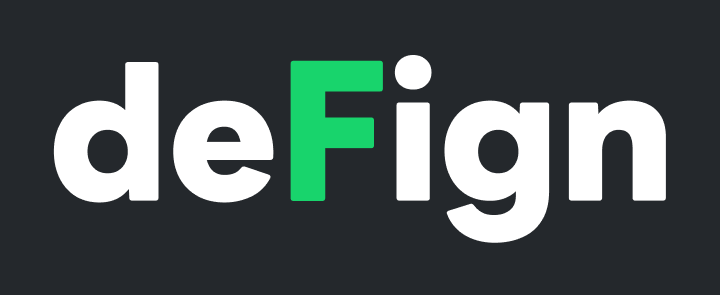

<strong class="yellow">design</strong> + <strong class="green">Financial</strong> = <strong>deFign</strong>

<b>디파인</b>, Financial의 디자인(을) / 정의하다

<small><em>"디자인시스템TF"</em> 결성 2023.01.01</small>

-----

#### 제품마다

- 정해진 스타일이 없으니 제품을 디자인할 때마다 <strong class="yellow">매번 같은 고민, 같은 잡무</strong>가 반복
- <!-- .element class="fragment" --> 감독하지 않고선 유지되지 않는 <strong>디자인의 일관성</strong>
- <!-- .element class="fragment" --> 다르지만 유사한 디자인과 UX에 대한 <strong>반복 개발</strong>
- <!-- .element class="fragment" --> 개발자에 따라 달라지는 <strong class="yellow">개발 품질</strong>

-----

#### 디자인 토큰 (using Figma API)

- color/typography/shadow/radius + <strong class="yellow">icon</strong>

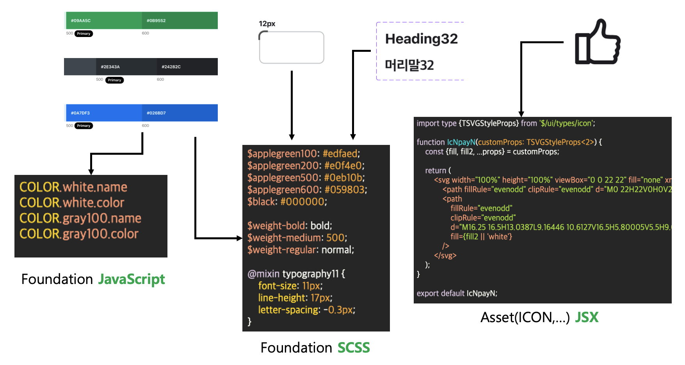

-----

#### 디자인시스템 컴포넌트

- <strong class="yellow">디자인 토큰</strong>을 이용하여 컴포넌트 개발
- 반응형 레이아웃, 디바이스, 에러케이스 대응...

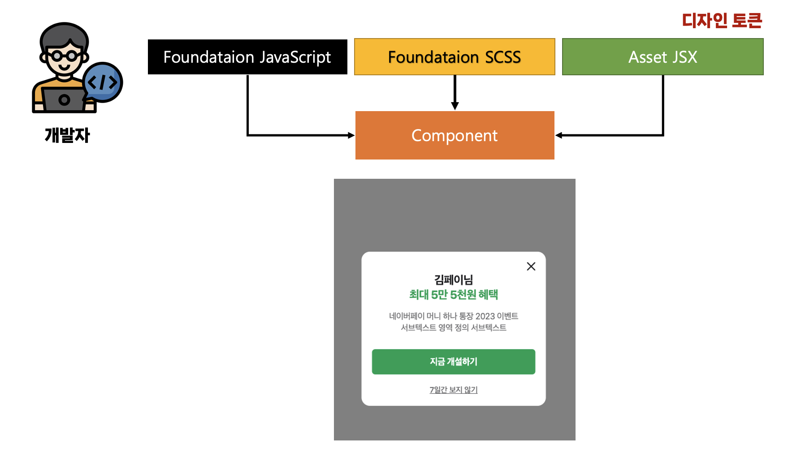

-----

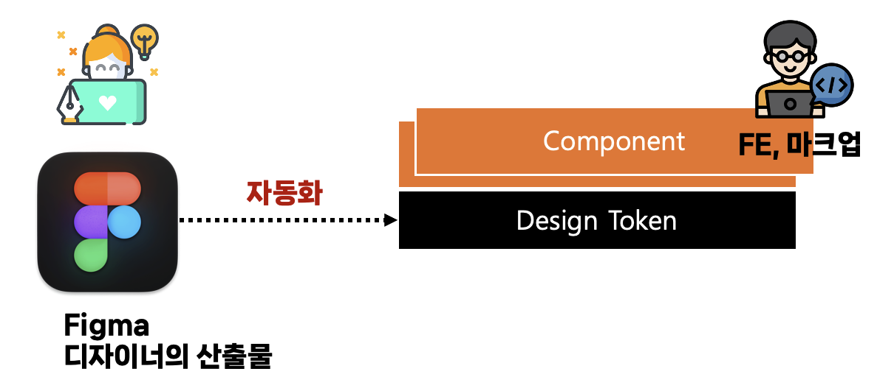

재사용 가능한 디자인 산출물 <strong>Figma</strong> → 개발 산출물 <strong>코드</strong>

-----

네이버 파이낸셜 서비스에서는

### FE, 마크업과 함께 <strong class="yellow">디자인시스템</strong>을 사용하고 있습니다

<p class="fragment">마크업을 만들때 <strong>디자인시스템을 잘 사용</strong>해야합니다...</p>

-----

### 우리를 도와 줄 AI는? (彼)

- <!-- .element class="fragment" --> AI는 <strong class="yellow">박학다식 하지만 책상물림</strong> <p>우리의 상황을 잘 알지는 못해욧!</p>
- <!-- .element class="fragment" --> AI는 <strong class="yellow">변덕쟁이</strong> <p>그때 마다 달라욧!</p>

-----

## 百戰不殆

자~ 그럼 어떻게 해야 할까? 🤔️

-----

#### Q. 설계의 산출물 Figma를 AI가 알 수 있을까?

<p class="yellow fragment">Figma Dev Mode MCP</p>

-----

#### Q. 네이버파이낸셜 디자인시스템을<br/> AI가 알 수 있을까?

- <!-- .element class="fragment" --> Q. 네이버 디자인 시스템 토큰을 알까?
    <p class="yellow fragment">LLM에게 알려주자 📚 (instructions or MCP)</p>
- <!-- .element class="fragment" --> Q. deFign 컴포넌트, icon 코드 사용법은 알까?
    <p class="yellow fragment">Figma Code Connect</p>

-----

#### Q. 마지막으로 AI 변덕은 어떻게 해결하지?

<p class="yellow fragment">LLM 혼내보자 🔥️ (instructions)</p>

-----

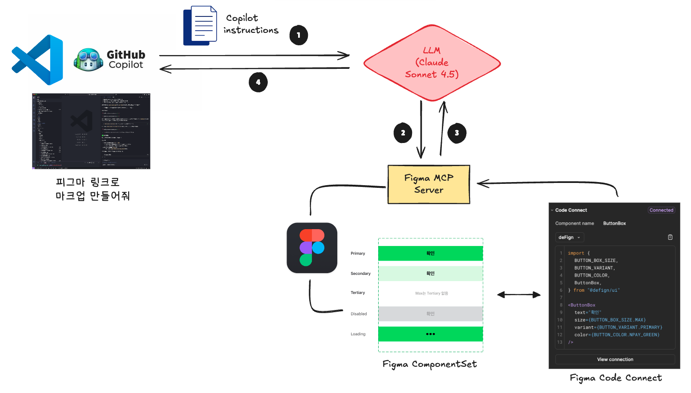

-----

<!-- .slide: data-background="#e7ad52" -->
# Let's try

-----

<div class="r-stack">
  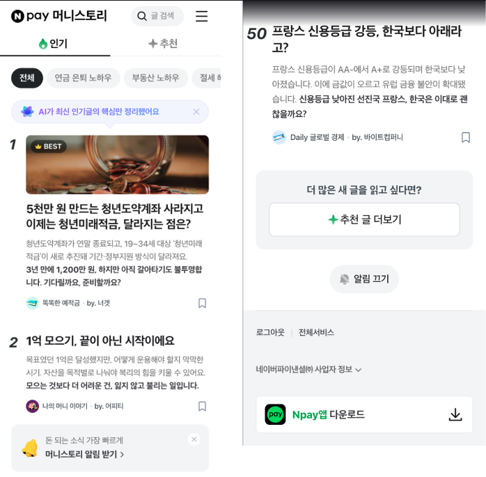
  
  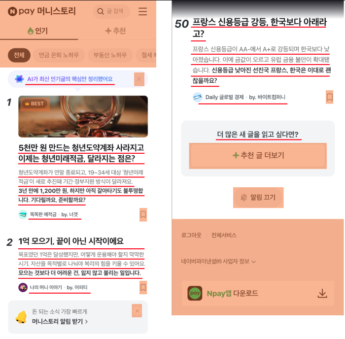
</div>

-----

실제 Figma 링크로 해보자
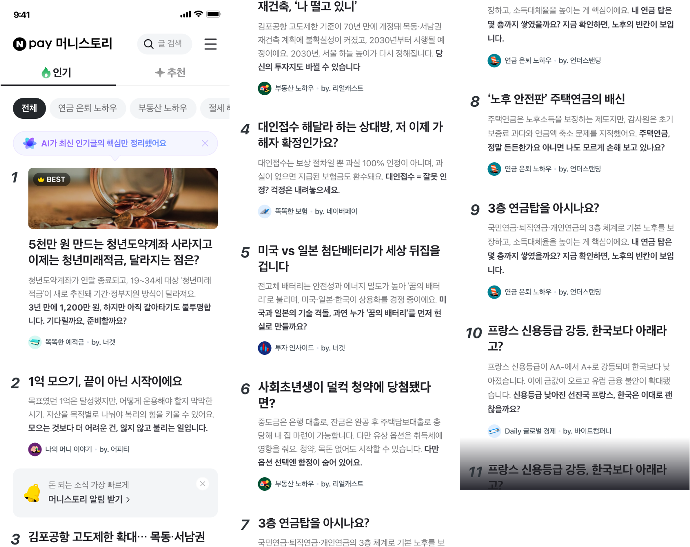

-----

### Figma Dev Mode MCP 연결해 보자

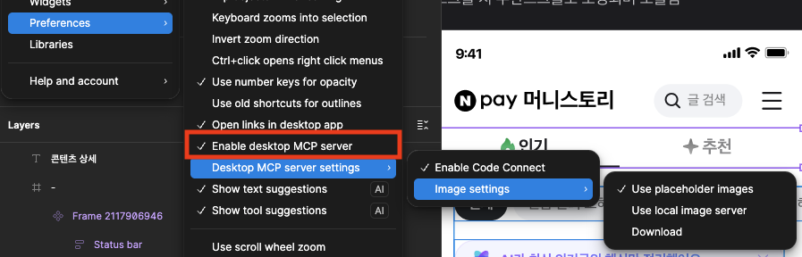

<small><em><a href="https://help.figma.com/hc/en-us/articles/32132100833559-Guide-to-the-Figma-MCP-server" target="_blank">Guide to the Figma MCP server</a></em></small>

-----

## "피그마에서 선택된 영역 마크업으로 만들어줘"

-----

구조만... <strong class="yellow">반응형</strong>은 안되고, 빼먹기도하고, <strong>그냥 맘대로</strong>...
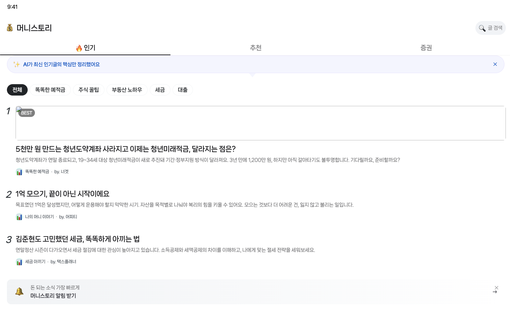

-----

세션별로 나름 잘 분리한 컴포넌트

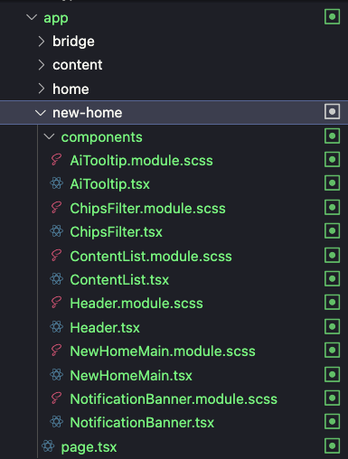

-----

하지만, <strong class="yellow">디자인시스템</strong>이 이미 있는데...

```tsx [11-21|37-39]
type TChip = {
    id: string;
    label: string;
    active?: boolean;
};

type TChipsFilterProps = {
    chips?: TChip[];
};

function ChipsFilter({chips = []}: TChipsFilterProps) {
    return (
        <div className={cx('chips-container')}>
            {chips.map((chip) => (
                <button key={chip.id} className={cx('chip', {active: chip.active})}>
                    {chip.label}
                </button>
            ))}
        </div>
    );
}

function AiTooltip() {
    const [isVisible, setIsVisible] = useState(true);

    if (!isVisible) {
        return null;
    }

    return (
        <div className={cx('tooltip-wrapper')}>
            <div className={cx('tooltip')}>
                <div className={cx('logo')}>✨</div>
                <p className={cx('text')}>
                    <strong>AI</strong>가 최신 인기글의 핵심만 정리했어요
                </p>
                <button className={cx('close-button')} onClick={() => setIsVisible(false)}>
                    ✕
                </button>
            </div>
            <div className={cx('arrow')} />
        </div>
    );
}
```

-----

<strong class="yellow">디자인 토큰</strong>도 이미 있는데...

```scss [5-7,12|17-19,21|37]

.text {
    flex: 1;
    margin: 0;
    font-family: 'Apple SD Gothic Neo', sans-serif;
    font-size: 14px;
    font-weight: 700;
    color: #0066ce;
    letter-spacing: -0.3px;
    
    strong {
        font-family: 'SF Pro Text', sans-serif;
    }
}

.rank {
    font-family: 'SF Pro Text', sans-serif;
    font-size: 24px;
    font-weight: 700;
    font-style: italic;
    color: #2e343a;
    line-height: 30px;
    min-width: 21px;
}

.content {
    flex: 1;
    display: flex;
    flex-direction: column;
    gap: 12px;
}

.image-wrapper {
    position: relative;
    width: 100%;
    height: 100px;
    border-radius: 8px;
    overflow: hidden;
}
```

-----

<!-- .slide: data-background="#e7ad52" -->
<p style="color:black">마크업 작업을 위한</p>

# 사전 준비 작업

-----

### 디자인시스템에 Code Connect 적용

Figma 컴포넌트와 아이콘 코드 연결
<small><em><a href="https://help.figma.com/hc/en-us/articles/23920389749655-Code-Connect" target="_blank">Code Connect</a></em></small>
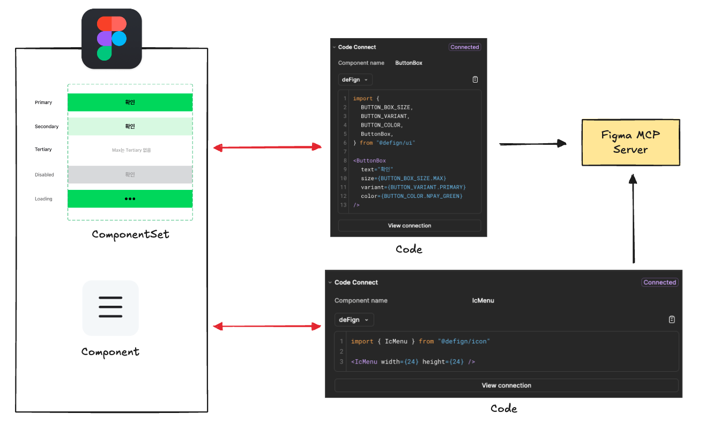

-----

### 네이버파이낸셜 디자인시스템

휴~ 쉽지 않다

- 컴포넌트 <em>80+</em>개 <strong class="yellow fragment">직접 연결</strong></p>
- 아이콘 <em>240+</em>개 <strong class="fragment">Figma API</strong>

-----

### 디자인시스템 instruction 적용

```md [1-5|9-12|21|34,38-40,47|49,56|69|79|95]
### 100.1 기본 원칙

- `@defign/ui`, `@defign/icon`, `@defign/asset` 최우선 사용
- Code Connect 매핑 우선. 매핑 불가 시 최소 커스텀 구현
- Figma 디자인과 **시각적으로** 정확하게 일치하는 형태로 구성한다. 임의 추측 금지. **위치, 크기, 마진 정확한 값을 사용한다.**
- 코드 생성 시 작업은 **100.7 작업 순서 권장 플로우** 를 준수한다.
- 코드 생성 작업 완료 후에는 **100.8 리뷰 체크리스트 (빠른 자가 검증)**을 항상 실행하고 검증한다.

### 100.2 Code Connect & 컴포넌트 매핑

- Figma 인스턴스 → Code Connect 매핑 우선.
- Code Connect는 `deFign` label을 참조한다.
- 컴포넌트 구현 규칙 (필수)
  - `@defign/ui` 사용.
  - Code Connect 맵핑 불가 시 CSS Module + deFign 디자인 토큰으로 최소 구현한다.
- 아이콘 구현 규칙 (필수)
  - `@defign/icon` 사용.
  - 아이콘이 `@defign/icon`에 존재하지 않는 경우에는 placeholder로 대체한다.
  - 아이콘의 크기/위치/모양 Figma와 동일하게 구현한다

### 100.3 deFign 디자인 토큰

- deFign 디자인 토큰은 **@deFign/foundation과 @defign/ui** 패키지에서 제공된다.
- @defign/foundation: **node_modules/@defign/foundation/dist/scss/token** 디렉토리 하위의 scss 파일로 존재한다.
- @defign/ui: **node_modules/@defign/ui/dist/scss/markup** 디렉토리 하위의 scss 파일로 존재한다.
- color/typography/shadow/radius: `@defign/foundation` SCSS 변수를 사용.
  - color/typography/radius/shadow는 토큰 우선 사용.
  - color/typography/radius/shadow 토큰이 존재하지 않으면 Figma 값으로 scss 직접 구현. **임의 수치 추론 금지**
  - **반드시 scss 변수명을 deFign 디자인 토큰 파일에서 확인하고 사용한다.**
- margin, padding 간격은 Figma 값 그대로 scss로 직접 구현한다.
- 사용 예시
- ...
  
### 100.4 레이아웃

- Figma 프레임의 width가 375px 인 경우 페이지로 인식한다.
- **iPhone X/Status Bars/Status Bar (Black), StatusBariOS, StatusBarAOS, naverToolBar** 와 같이 디바이스의 외형을 나타내는 Figma 컴포넌트는 크기가 0 으로 코드로 구현하지 않는다.
- 하나의 페이지에는 하나의 FlexibleLayout만이 존재한다.
- 하나의 페이지를 구성할 때에는 **FlexibleLayout + Header 형태**의 구조로 구현한다.
  - 단일 `<FlexibleLayout>` + Header(topElement).
  - children = 실제 페이지 콘텐츠 컴포넌트.
  - 상세한 코드는 **레이아웃 샘플 (필수)** 코드를 참조한다.
- 페이지 콘텐츠의 컨테이너는 다음의 규칙을 준수한다.
  - max-width, min-width 등은 사용하지 않는다.
  - "헤더를 포함한 StickyHeaderContentArea"를 사용하는 경우에는 FlexibleLayout의 topElement로 "헤더를 포함한 StickyHeaderContentArea"를 지정한다.
  - 컨텐츠 영역(SomeContentPageContent)은 별도로 분리해서 FlexibleLayout 의 children으로 구성 한다.
- **Figma 디자인의 정확한 좌표를 기준으로 각 세션영역의 간격은 margin으로 적용한다.**

### 100.5 페이지 콘텐츠 구현

- 페이지에 맞게 내부 컨텐츠는 디자인토큰을 이용하여 반응형에 대응할 수 있도록 구성한다.
- 반복 UI: 배열 + `map`
- 반복되는 데이터는 Figma 내용을 최대한 반영한 Mock 데이터로 처리한다.
- Mock 데이터는 최소 3개 이상, Figma 내용을 전부 다 반영한다.

#### 이미지 구현 규칙

- 이미지 placeholder 크기와 위치를 Figma와 동일하게 구성한다.
- 이미지 태그는 img를 사용한다.
- 마크업 속성으로 처리 가능한 부분은 가급적 마크업으로 대처한다.
  - 예시. 말풍선과 같이 말풍선 꼬리 부분은 **:after, :before** 선택자 등을 사용하여 표현한다.

#### 한 줄 영역 구현 규칙

- 컨테이너 내부 가로 크기는 유연하게 확장 되는 구조로 작성하고, 좌우 패딩으로 아이콘/버튼 공간을 확보한다.
- 높이는 Figma 값으로 고정한다.


### 100.6 금지 사항

- 추측 애니메이션/상호작용 금지
- 기능 과추측 / 디자인 미존재 요소 임의 추가 금지
- 임의로 추측한 margin/padding 확장 금지
- 패턴 중복 구현 금지
- 의미 없는 임의 요소/문구 추가 금지
- deFign 디자인 토큰 추론 금지
- **주석 금지** 꼭 필요한 경우에만 제안 후 허용

### 100.7 작업 순서 권장 플로우

1. deFign 디자인 토큰 scss 변수 확인.
2. Figma 링크 내 Code Connect 매핑 가능한 컴포넌트 식별.
3. 레이아웃(`FlexibleLayout`) 뼈대 구현 → Header 매핑.
4. typography/color/radius/shadow 토큰 치환
5. 아이콘 @defign/icon 치환.
6. Figma 수치에 맞게 크기 및 여백 조정.
7. Code Connect 매핑 가능한 컴포넌트 `@defign/ui` 컴포넌트로 치환.
8. 잔여 미매핑 요소 최소 커스텀 구현.
9. A11y 확인 (heading, alt, role, label).
10. 반복 패턴 단위 컴포넌트 작성 (반복 패턴 우선)
11. 시각적으로 Figma와 정확히 일치하는지 최종 확인.
12. stylelint 로 스타일 검사를 통과해야 한다.
13. 타입스크립트 오류 없는지 확인.

### 100.8 리뷰 체크리스트 (빠른 자가 검증)

- [ ] `@defign/ui`, `@defign/icon`, `@defign/asset`  우선 사용
- [ ] 레이아웃(`FlexibleLayout`) 샘플 형태로 구현되었는지 확인한다.
- [ ] color/typography/shadow/radius 토큰 변수명이 deFign 디자인 토큰 파일에 존재하는지 확인한다.
- [ ] color/typography/radius/shadow 토큰이 존재하지 않으면 Figma 값으로 scss 직접 구현. 추론금지
- [ ] **시각적으로 Figma와 정확히 일치하는지 Figma MCP를 통해 최종 확인**
  - [ ] **Figma 디자인의 정확한 좌표를 기준으로 각 세션영역의 간격이 시작적으로 잘 적용되었는지 확인한다**
  - [ ] 디자인 상 의미 없는 임의 요소/문구 추가 금지
- [ ] **스타일 오류 최종 확인**
- [ ] **타입스크립 오류 최종 확인**

```

-----

이렇게 하면...

### 마크업 사전 준비는 완료

-----

<h3 class="fragment" data-fragment-index="1"><strong class="yellow">훨씬 좋아졌네요</strong></h3>

<div class="r-stack">
  
  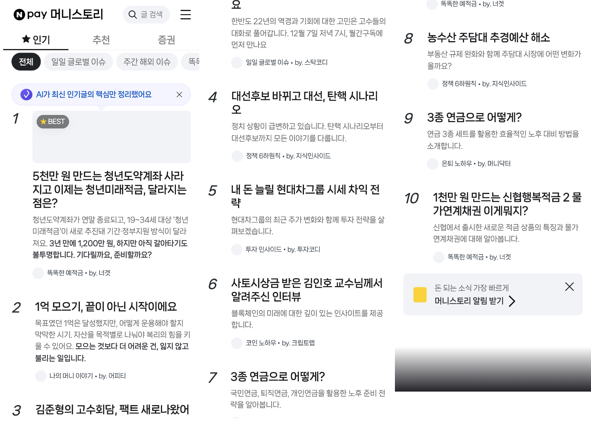
  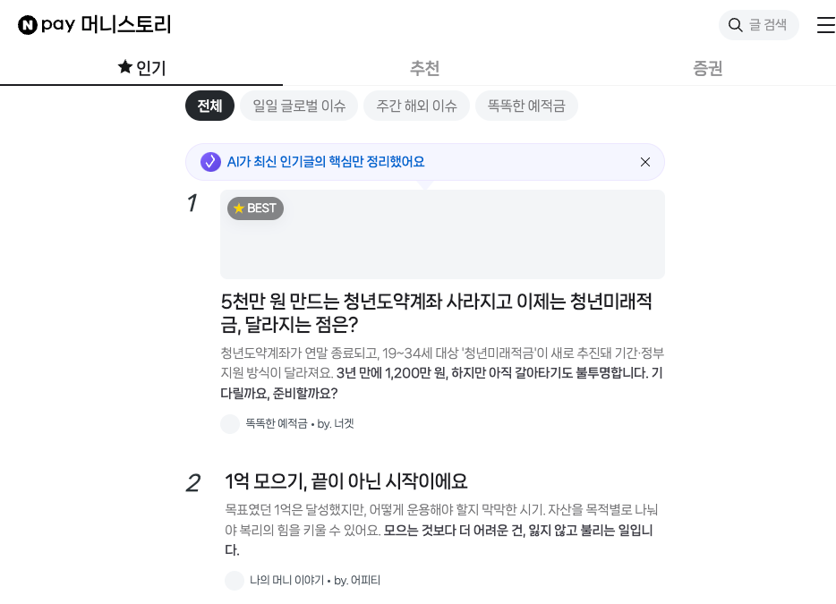
</div>

-----

### 코드도 살펴 볼까요?

-----

<strong class="yellow">컴포넌트</strong> 잘 사용하고 있네요.

```tsx [1-2|13]
import {ChipsMenu as DefignChipsMenu, CHIP_PADDING_TYPE, CHIP_VARIANT} from '@defign/ui';
import type {TChipMenu} from '@defign/ui';
import type {FC} from 'react';

export function ChipsMenu(): ReturnType<FC> {
    const menuItems: TChipMenu[] = [
        {content: '전체', active: true},
        {content: '일일 글로벌 이슈', active: false},
        {content: '주간 해외 이슈', active: false},
        {content: '똑똑한 예적금', active: false},
    ];

    return <DefignChipsMenu items={menuItems} variant={CHIP_VARIANT.FILL} paddingType={CHIP_PADDING_TYPE.PADDING16} />;
}
```

-----

<strong class="yellow">아이콘</strong> 잘 사용하고 있네요.

```tsx [1|14]
import {IcClose} from '@defign/icon';
import type {FC} from 'react';
import styles from '$/app/new-home/components/TooltipBanner.module.scss';

export function TooltipBanner(): ReturnType<FC> {
    return (
        <div className={styles.container}>
            <div className={styles.header}>
                <div className={styles.logo} />
                <p className={styles.title}>
                    <span className={styles['title-ai']}>AI</span>가 최신 인기글의 핵심만 정리했어요
                </p>
                <button type="button" className={styles['close-button']}>
                    <IcClose width={14} height={14} />
                </button>
            </div>
            <div className={styles.arrow} />
        </div>
    );
}
```

-----

<strong class="yellow">디자인 토큰</strong> 잘 사용하고 있음.

```scss [2-4|9-11]
.title {
  @include defign_typography20;
  font-weight: $defign_weight-bold;
  color: $defign_gray900;
  margin: 0;
}

.description {
  @include defign_typography14;
  font-weight: $defign_weight-regular;
  color: $defign_gray700;
  line-height: 1.6;
  margin: 0;
}
```

-----

이제 FE 개발 시작해도 될 마크업

### 하지만 아쉬웠던 점

-----

<strong class="yellow">시각적으로 표현하지 않아야하는 경우</strong>

<div class="r-stack">
  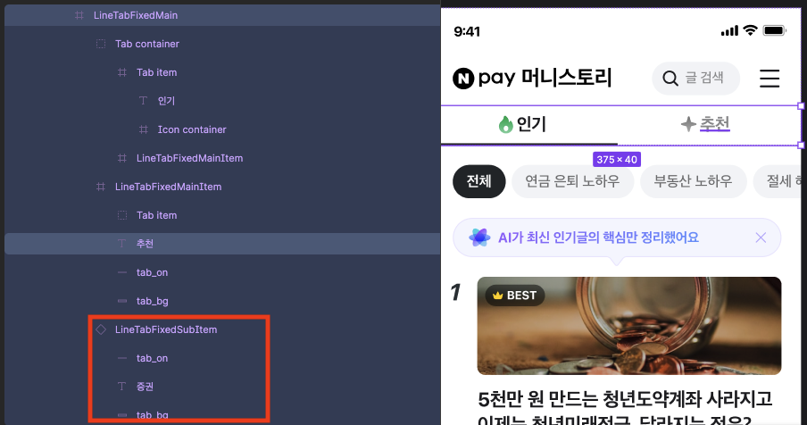
  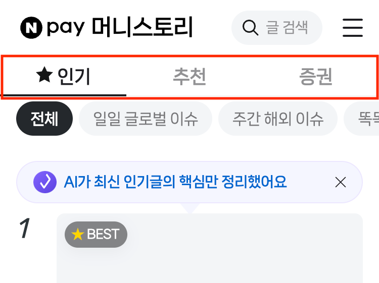
  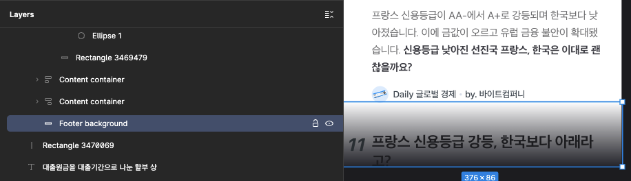
    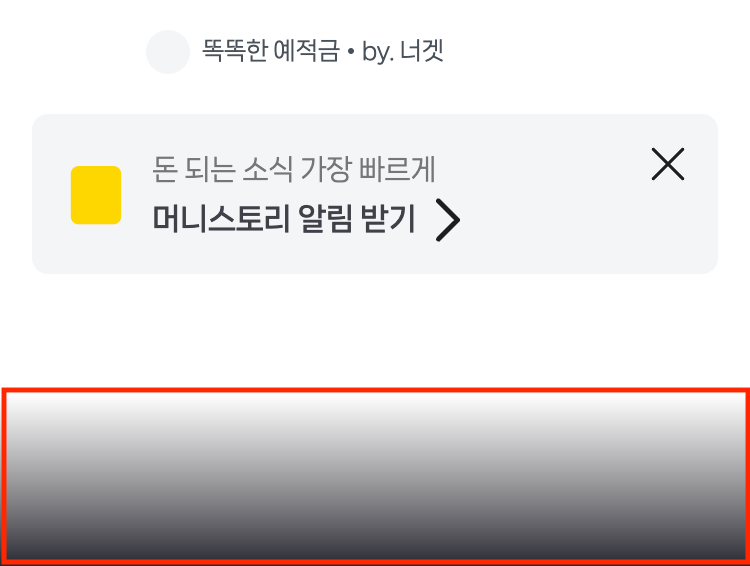
</div>

-----

각 세션과의 <strong class="yellow">간격(margin)</strong>의 불일치

<div class="r-stack">
  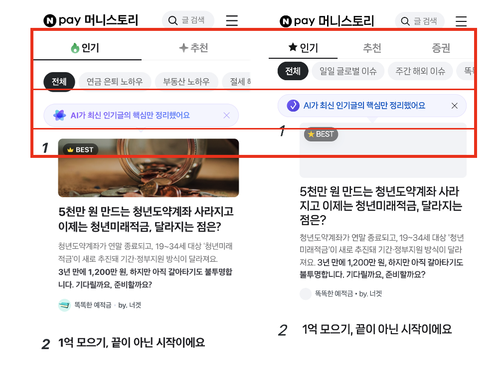
  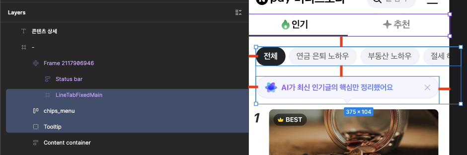
</div>

-----

디자인시스템 <strong class="yellow">안 쓴 부분</strong>의 불일치

<div class="r-stack">
  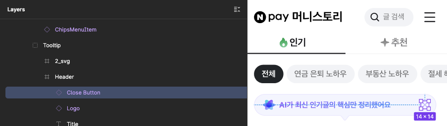
  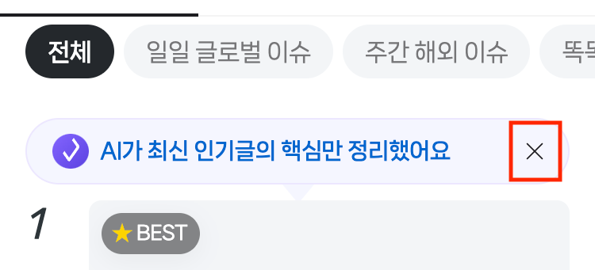
  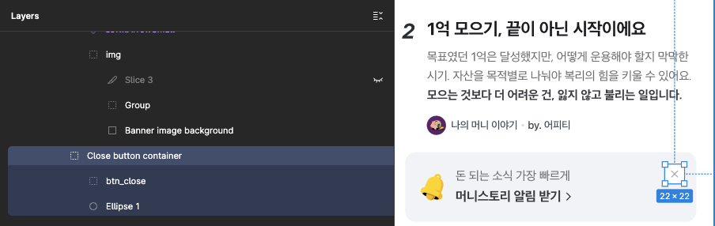
  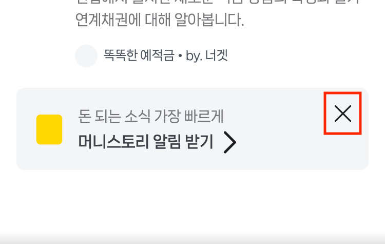
</div>

-----

### 그 외로 힘들었던 점

- 디자인 요소가 많으면 <strong>LLM이 바보</strong>가 됩니다...
- <!-- .element class="fragment" --> 똑똑한척 하는 LLM. 마크업만 만들려는데 <strong class="yellow">기능을 추론</strong>해서 만들어요...

-----

<!-- .slide: data-background="#e7ad52" -->
# 현실 개발에서는 <br/>어떻게 해야하는가?

-----

### 1. 사전 작업이 <strong class="yellow">충분히</strong> 준비되어야 함

- 디자인시스템 구축은 선택이 아닌 <strong>필수</strong>
- <!-- .element class="fragment" --> Code Connect 연결 <strong>필수</strong>
- <!-- .element class="fragment" --> 디자인 시스템에 대한 Instruction 또는 MCP
- <!-- .element class="fragment" --> 마크업을 위한 금지사항 (Instruction)

-----

### 2. 바보 LLM을 위해 <strong>작업 분할</strong>이 필요함

- <!-- .element class="fragment" --> 선택된 피그마를 기준으로 /new-home 패스에 우선 <strong class="yellow">레이아웃 구조</strong>만 만들어줘
- <!-- .element class="fragment" --> 선택된 피그마와 시각적으로 일치하도록 마크업 확인해줘
- <!-- .element class="fragment" --> ...
- <!-- .element class="fragment" --> 체크리스트 기반으로 전체 피그마와 시각적으로 동일한지 확인해줘

-----

### 3. 무엇보다도 <strong class="yellow">설계시 고려해야할 것</strong>

<small><em><a href="https://developers.figma.com/docs/figma-mcp-server/structure-figma-file" target="_blank">Structure your Figma file for better code</a></em></small>

- <!-- .element class="fragment" --> LLM이 이해할 수 있게 프레임명 잘 작성하기
- <!-- .element class="fragment" --> 디자인시스템 꼭 쓰도록 가이드
- <!-- .element class="fragment" --> 완벽한 간격을 위해서는 <strong>무조건 Auto Layout</strong> <p>안쓰면 마진은 개발자의 몫</p>
- <!-- .element class="fragment" --> 시각적으로 표현되지 않는 것은 제거 <p>불필요한 레이어가 많아. 복붙이 더 쉬워서...</p>

-----

설계자가 하는데...

### 그게 내 맘대로 되는가?


-----

### 툴로 가이드 하고 유도하자

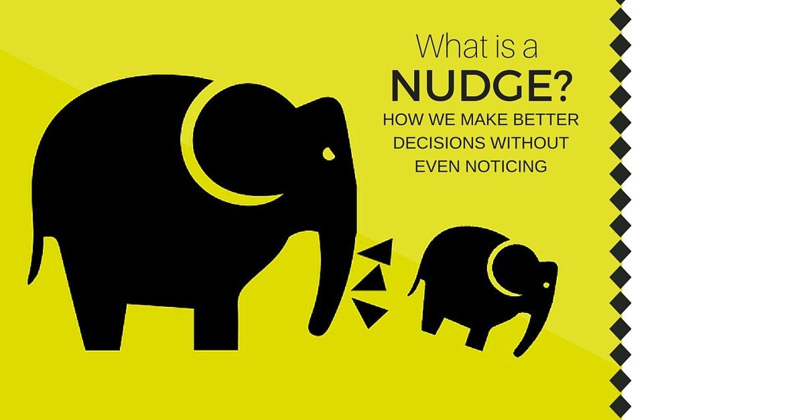

-----

### Rename Layer

LLM이 이해할 수 있게 프레임명 잘 작성하기
<div class="r-stack">
  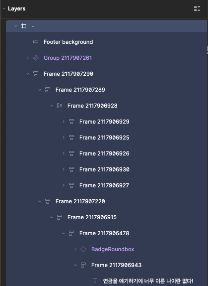
  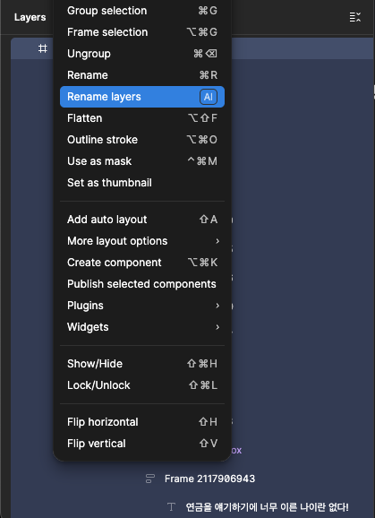
  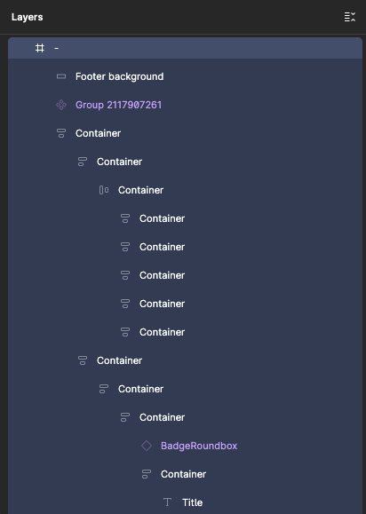
</div>

-----

### deFign assistant

파이낸셜 디자인시스템 잘 쓰기 위한 <strong class="yellow">Figma Plugin</strong>

<div class="r-stack">
  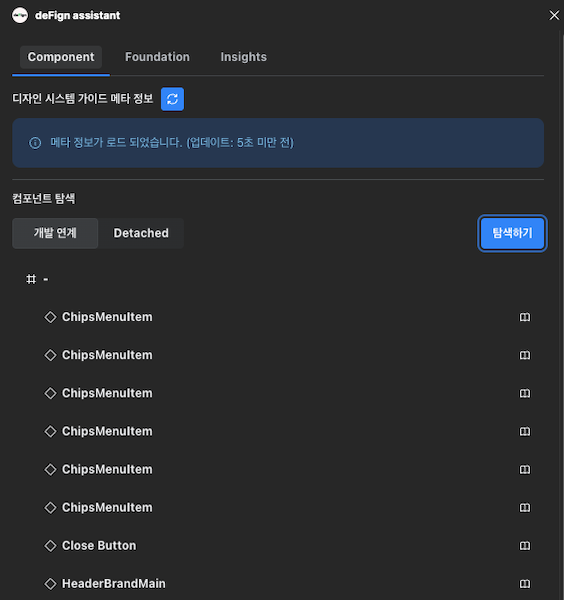
  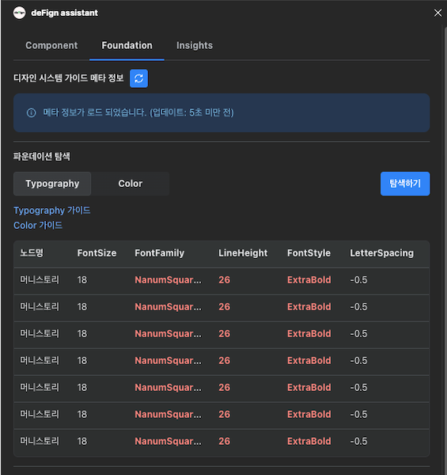
  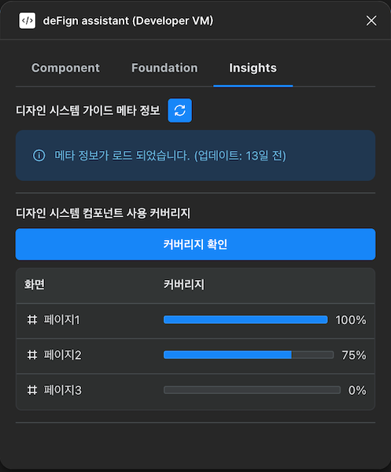
</div>

-----

<!-- .slide: data-background="#e7ad52" -->
# 마크업 직접 개발했더니 어떠니?

-----

- FE 개발자가 <strong class="yellow">Figma를 더 살펴</strong>보게 되었고
- <!-- .element class="fragment" -->  구조를 직접 만들면서에서 <strong>스펙 이해도</strong>를 높일 수 있어서 좋았어.
- <!-- .element class="fragment" -->  <strong>커뮤니케이션은 당연히 줄었어</strong><br/><p>프로세스가 없어졌으니...</p>
- <!-- .element class="fragment" --> 마크업 <strong class="yellow">개발 시간도 줄었어</strong>

-----

### 그런데... 말야

- <!-- .element class="fragment" -->  마크업 개발을 위해 <strong>초기 준비 비용</strong>
- <!-- .element class="fragment" -->  마크업 만드는 것보다 <strong class="yellow">마크업 리뷰</strong> 비용 <br/><p>아직 익숙하지 않거든</p>
- <!-- .element class="fragment" -->  마크업 <strong class="yellow">운영 이슈</strong> FE 개발자가 잘 할 수 있을까? <br/><p>우려스러운 부분은 사실</p>

-----

### 하지만

 <!-- .element class="fragment" -->AI를 통한 개발 프로세스가 <strong>가능하다</strong>

- <!-- .element class="fragment" --> AI는 <strong class="yellow">더 발전</strong>할 거고,
- <!-- .element class="fragment" --> 브라우저는 점점 최신화.
- <!-- .element class="fragment" --> <strong class="yellow">Figma</strong> 또한 굉장히 빠르게 변화!

-----

### 문제는

<h2 class="fragment"><strong>초기 진입 비용과 경험</strong></h2>
<small class="fragment"><p>다음 발표에서는 실제로 운영 경험과 함께 다시 올께요 👋️</p></small>
