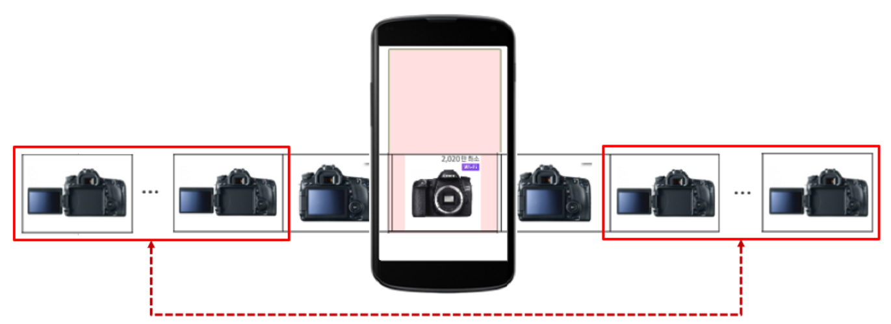
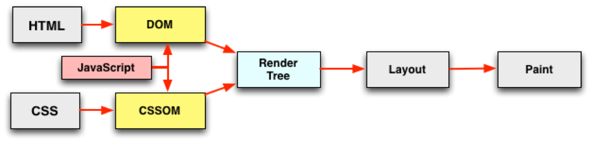

## 저 소개

발표의 <strong>신뢰도</strong>를 높이기 위해서 내 소개

- <!-- .element: class="fragment" data-fragment-index="1"--> 네이버 <strong class="yellow">모바일 메인</strong> FE성능 개선 작업 
- <!-- .element: class="fragment" data-fragment-index="2"--> 네이버 <strong class="yellow">모바일 날씨</strong> FE성능 개선 작업 
- <!-- .element: class="fragment" data-fragment-index="3"--> 네이버 <strong class="yellow">쇼핑</strong> FE성능 개선 작업 
- <!-- .element: class="fragment" data-fragment-index="4" --> 네이버 <strong class="yellow">블로그</strong> FE성능 개선 작업
- <!-- .element: class="fragment" data-fragment-index="5" --> 네이버 <strong class="yellow">스토어팜</strong> FE성능 개선 작업 
- <!-- .element: class="fragment" data-fragment-index="5" --> 네이버 <strong class="yellow">modoo</strong> FE성능 개선 작업
- <!-- .element: class="fragment" data-fragment-index="5" --> 네이버 <strong class="yellow">Pay</strong> FE성능 개선 작업
- <!-- .element: class="fragment" data-fragment-index="5" --> ... 

-----

### 오늘 발표는 

여러분에게 <strong>통찰력</strong>을 주기 위한 발표입니다. 
<br><br>

<i class="blue">굉장히 익숙한 내용</i>에 대해 이야기 할 것입니다.

하지만, <strong class="yellow">원리</strong>에 집중해서 들어주세요


-----


<!-- .slide:data-background="#8c4738" -->
## 우리가 알고 있는 성능에 대한 상식

-----

- 성능 개선은 <strong class="blue">빠르면 빠를 수록 좋다.</strong> 
- <!-- .element: class="fragment" --> 로딩속도는 <strong class="blue">수치적으로</strong> 빠르면 빠를 수록 좋다. 
- <!-- .element: class="fragment" --> 특정 부분의 성능을 개선하면 <strong class="blue">개선한 만큼 성능 향상이 된다.</strong>
- <!-- .element: class="fragment" --> 서비스 성능이슈는 <strong class="blue">개발자의 무지</strong>에서 나온다. 
- <!-- .element: class="fragment" --> 성능 전문가는 서비스의 성능개선 포인트를 <strong class="blue">찾고 개선할 수 있다.</strong> 
- <!-- .element: class="fragment" --> 서비스 성능 개선은 전문성을 갖춘 영역이기에 <strong class="blue">아무나 할 수 없다.</strong>

-----

<!-- .slide:data-background="#e7ad52" -->

## 성능 분석가의 관심사 (GOAL)

-----

### 서버 성능분석가의 관심사는?
<p class="fragment">서버가 얼마나 <strong>많은 요청을 처리</strong>할 수 있니?</p>

<h3><strong class="fragment yellow">TPS (Transition Per Seconds)</strong></h3>

-----

### FE 성능분석가의 관심사는?
<p class="fragment">사용자 입력에 얼마나 <strong>빠르게 반응</strong> 할 수 있니?</p>
<h3 class="fragment"><strong class="yellow">LAI (Loading And Interaction)</strong></h3>
<h2 class="fragment blue">에라이</h2>

-----

### LAI (Loading And Interaction) 

<ol>
  <li class="fragment">
    <strong class="blue">초기 로딩 속도 (Loading)</strong>
    <p>얼마나 빨리 페이지를 볼 수 있는가?</p>
  </li>
  <li class="fragment">
    <strong class="blue">인터렉션 속도 (Interaction)</strong>
    <p>스크롤이 버벅 거려요</p>
    <p>키보드를 입력하는데 버벅 거려요.</p>
    <p>얼마나 매끄럽게 애니메이션이 동작하는가?</p>
  </li>
</ol>

-----

<!-- .slide:data-background="#e7ad52" -->
## 성능 개선 작업 어떻게 할 것인가? (PLAN)

-----

<!-- .slide:data-background="./image/forest.jpg" -->
### 1. 대상 선정하기

가장 중요한 것. <h3><strong>숲을 보기</strong></h3>

- <!-- .element: class="fragment" --> 서비스에서 가장 <strong class="yellow">많이 사용하는</strong> 화면이 무엇인가?
- <!-- .element: class="fragment" --> 서비스에서 사용자에게 <strong class="yellow">가치 있는 화면</strong>이 무엇인가?


-----

### 2. 개선 프로세스

테스트에 <strong style="color:red">Red</strong>-<strong class="green">Green</strong>-<strong class="grey">Refactory</strong> 프로세스가 있다면...

<strong>성능 개선</strong>에서는

- <!-- .element: class="fragment" --> 측정 (Measure)
- <!-- .element: class="fragment" --> 분석 (Analytic)
- <!-- .element: class="fragment" --> 최적화 (Optimize)

<blockquote class="fragment yellow"> 측정 - 분석 - 최적화 - 측정 - 분석 - 최적화 - ...  </blockquote>

-----

### 3. 언제까지? 

<!-- .element: class="fragment" --> <strong class="yellow">목표</strong>에 도달할 때 까지.

<!-- .element: class="fragment" --> 그럼 목표는?

<!-- .element: class="fragment" --> 초기 로딩 속도 <strong class="blue">3초(?)</strong>

-----

성격 급한 한국인이 많이 쓰는...
### 네이버는?

<p>초기 로딩 속도</p>
<ul class="fragment">
  <li>모바일: 1.5초</li>
  <li>PC: 2초</li>
</ul>

-----

### 구글은? 
						
<div class="fragment">
  
  <small>developers.google.com <a href="http://goo.gl/axNG6r">http://goo.gl/axNG6r</a></small>
  <p class="fragment">Load는 사용자에게 꼭 보여주어야하는 부분을 기준 <strong class="yellow">FMP</strong></p>
</div>

-----


<!-- .slide:data-background="#8c4738" -->
## 성능 개선 작업 시작하기 Part 1.
<p>초기 로딩속도 개선하기</p>

-----


### 페이지 로딩 과정

<video src="./loadingprocess.mov" controls />

-----

### 로딩 속도 측정/분석 하기
핵심은 <strong class="yellow">Waterfall 차트</strong>

 <!-- .element: style="height:400px" -->

-----

### 로딩 속도 개선하기
<strong class="big">높이</strong>를 줄이고,

<strong class="big">폭</strong>을 줄이고,

<strong class="big">간격</strong>을 땡긴다.

<p class="fragment">마지막으로 <strong class="big yellow">총체적으로 점검</strong>하기.</p>

-----

<!-- .slide:data-background="#305930" -->
### 1. 높이 줄이기: Reqeust 수 줄이기


-----

#### JS, CSS Merge


-----

#### CSS Sprite


여러 이미지를 <strong class="yellow">하나의 Request로!</strong>

-----

#### DATA URI


캐싱되지 않아도 될 이미지를 <strong class="yellow">HTML 요청에 포함</strong>시켜서~!

-----

#### 가장 효과적인 방법
초기 로딩 시 <strong >불필요 없는 자원</strong>은 삭제하거나 뒤로(Lazy)

- <!-- .element: class="fragment" --> 실수로 요청한 자원들
- <!-- .element: class="fragment" --> 초기 로딩시 필요 없는 <strong class="yellow">JS</strong>
- <!-- .element: class="fragment" --> 뷰 포트 바깥에 있는 <strong class="yellow">이미지</strong>

-----

가장 효과적인 것은 뭐니뭐니 해도

#### 이미지


<div class="fragment">
  <small>2019/01 <a href="https://httparchive.org/reports/page-weight?start=2019_01_01&end=latest&view=grid">httparchive</a> 기준</small>
  <p>이미지는 <strong>50% 이상</strong> (전체의 1.6M 중 840KB)</p>
</div>

-----

#### 다른 의미에서 더 중요한 것.

브라우저는 호스트당 <strong class="yellow">동시에 연결 할 수 있는 개수</strong>가 정해져 있다.
 <!-- .element: style="height:500px" -->

-----

요청 수가 많으면 많을수록 

<strong>사용할 수 있는 connection 수를 초과</strong>하여 

다른 요청은 브라우저에서 대기한다.

 <!-- .element: class="fragment" -->

<strong class="fragment yellow">요청은 줄이면 줄일 수록 좋다</strong>

-----

<!-- .slide:data-background="#305930" -->
### 2. 폭 줄이기 : Request 시간 줄이기


-----

많은 정보를 담고 있는 Request!

 <!-- .element: style="height:500px" -->

-----

#### Initial Connection

HTTP 프로토콜 마다 Connection 활용 방법이 다르다.

 <!-- .element: style="height:400px" -->

<h3 class="fragment"><strong>HTTP2</strong>가 정답입니다.</h3>

-----

#### Time to First Byte (TTFB)

TTFB가 오래 걸린다면 

<h3 class="fragment"><strong>서버 비즈니스 로직이 느린 것</strong></h3>

-----

#### Content Download

Content Download가 오래 걸린다면 
- <strong class="grey">네트워크 속도</strong>가 낮거나
- <strong class="yellow">컨텐츠의 크기</strong>가 큰 경우이다.

-----

#### minify, obfuscation, gzip

 <!-- .element: style="height:380px" -->

<small>gzip 적용(`content-encoding: gzip`)시  <strong>전체 데이터량의 30% 정도 감소</strong></small>

-----

역시나 가장 효과적인 것은 뭐니뭐니 해도

#### 큰 이미지 줄이기

 <!-- .element: style="height:380px" -->

<small class="fragment">이미지 포맷(png, webP, jpeg, ...), 이미지 메타정보 날리기 </small>

-----

#### 다른 의미에서 더 중요한 것

Decode 비용


이미지 데이터를 RGB로 변환하는 과정

-----

하지만,
<strong class="yellow">매의 눈을 가진 디자이너</strong>가 원하는 이미지는 

<strong class="big fragment">레티나 (device-ratio: 2) 이상</strong>

-----

picture, source, srcset 태그를 사용

```
<picture>
  <source 
    srcset="IamWebp1x.webp 1x, IamWebp1x.webp 2x" 
    type="image/webp">
  <source 
    srcset="IamOldJPEG.jpg 1x, IamOldJPEG.jpg 2x" 
    type="image/jpeg"> 
  
</picture>
```
<strong class="fragment">현실적인 방법은 아님. </strong>
<p class="fragment">사실상 요즘 브라우저는 다 레티나 이상</p>
<strong class="big yellow fragment">눈 딱! 감고 이미지의 2배 크기</strong>

-----

<!-- .slide:data-background="#305930" -->
### 3. 간격 땡기기 : Request 계단 간격 땡기기


-----

 <!-- .element: style="width:600px" -->

1. <!-- .element: class="fragment" --> 서버로 부터 <strong class="yellow">HTML 문자열</strong>을 <strong>Stream</strong>으로 받음
2. <!-- .element: class="fragment" --> `<head>` 태그에 포함된 자원을 <strong>병렬</strong>로 다운로드
3. <!-- .element: class="fragment" --> `<head>` 태그에 포함된 자원을 <strong>모두 실행</strong>
4. <!-- .element: class="fragment" --> `<body>` 태그부터 <strong>화면을 그리기 시작</strong>
5. <!-- .element: class="fragment" --> DOM 구성이 완료되면 <strong class="yellow">DOMContentLoaded</strong> 이벤트 발생
6. <!-- .element: class="fragment" --> <strong class="blue">모든 자원의 로딩 완료</strong>되면 <strong class="yellow">load</strong> 이벤트 발생

-----

  <!-- .element: style="height:400px" -->

- <!-- .element: class="fragment" --> A. head 안의 모든 자원 <strong class="yellow">병렬 로딩</strong>
- <!-- .element: class="fragment" --> B. JS, CSS 실행시 페이지 <strong>랜더링 Block</strong>
- <!-- .element: class="fragment" --> C. 화면에 보여줄 것은 다 그려짐. 이미지는 로딩 안되어있음


-----

### 성능 격언


- head 태그에는 <strong class="blue">CSS와 필수 JS</strong>만 넣어라.
- <!-- .element: class="fragment" --> JS는 <strong class="yellow">body 태그 마지막</strong>에 넣어라. 중간 중간에 JS를 넣지 마라.


-----

#### async, defer


- <!-- .element: class="fragment" --> DOM 제어와 관련이 있는 스크립트는 <strong class="blue">defer</strong>를 이용
- <!-- .element: class="fragment" --> 의존성이 없는 스크립트는 <strong class="blue">async</strong>

-----

#### CSS 파일에서 폰트, 이미지를 사용


CSS가 불러진 다음에 CSS에서 사용하는 <strong class="yellow">폰트, 이미지</strong>가 로딩

-----

#### Preload


```
<link rel="preload" 
  href="https://example.com/fonts/font.woff" 
  as="font" crossorigin>
<link rel="preload" 
  href="https://example.com/css/style.css" 
  as="style" crossorigin>
```

CSS와 함께 <strong class="yellow">폰트, 이미지</strong>가 로딩

-----

#### HTTP2 Server Push


HTML과 함께 <strong class="yellow">JS, CSS, 이미지</strong>가 로딩

-----

<!-- .slide:data-background="#305930" -->
### 4. 총체적으로 점검하기


-----

#### 체감 속도 높이기

 <!-- .element: style="height:400px" -->

- First Paint(FP): <strong class="yellow">HEAD 태그</strong> 종료 후
- First Meaningful Paint(FMP): <strong>Hero 엘리먼트</strong>가 보이는 시기

-----

#### 서비스 개발자 또는 오너가 정해야할 것들


- <strong class="yellow">Hero 엘리먼트</strong>는 무엇인가?
- Lazy 하게 처리해서는 안되는 요소들

-----

#### 균형감 찾기

각각의 Request를 균등한 크기로 맞추기

<strong>튀는 놈 없애기!</strong>


<small>지나치게 큰 CSS, JS</small>

-----


<!-- .slide:data-background="#8c4738" -->
## 성능 개선 작업 시작하기 Part 2.
<p>인터렉션 속도 개선하기</p>

-----

## Case by Case!


<!-- .element: class="fragment" --> 하지만 딱! <strong>하나의 원리</strong>로 귀결!

<!-- .element: class="fragment yellow big" --> 브라우저 Main Thread 괴롭히지 말기

-----


문제는 바로 동적 언어인 <strong>JavaScript</strong>

<div class="fragment">
<p>JavaScript가 DOM을 건들면</p>
<p>기본적으로 <strong class="yellow">Main Thread</strong>에 의해 <strong class="blue">Rendering Pipeline</strong>이 동작!</p>
</div>

-----

### Rendering Pipeline 이해하기


<!-- .element: class="fragment" --> Javascript: <strong>JS로 DOM을 변경</strong>

2. <!-- .element: class="fragment" --> Style recalculate: DOM의 <strong class="yellow">최종 스타일을 계산</strong>
3. <!-- .element: class="fragment" --> Layout: DOM의 <strong class="yellow">배치와 크기 계산</strong>
4. <!-- .element: class="fragment" --> Paint: 화면에 그리기
5. <!-- .element: class="fragment" --> Composite: 레이어 조합하기 <strong>(Help me GPU!)</strong>

-----

<!-- .slide:data-background="#305930" -->
### 1. Layout 발생하는 속성 건드리지 않기
https://csstriggers.com/


-----

예1) top 변경


-----

예) transform 변경


-----

<!-- .slide:data-background="#305930" -->
### 2. 도와줘 GPU

CPU (Main Thread)가 아닌 <strong>GPU</strong>의 도움 받기

-----

<strong class="yellow">composite</strong>

웹 페이지는 하나의 거대한 레이어이다.


GPU는 각각의 레이어를 합치는 작업을 한다.


-----

GPU의 도움을 받기 위해 
### 레이어 만들기
<br>

- 브라우저가 <strong class="blue">규칙</strong>에 따라 레이어를 구성
- <strong class="yellow">명시적으로</strong> 레이어를 구성하기
<p class="fragment">translate3d, scale3d, matrix3d, will-change, ...</p>

-----

### GPU의 Side Effect

- 레이어를 초기 구성하기는 작업은 <strong class="blue">CPU(Main Thread) </strong>가 진행
- <!-- .element: class="fragment" --> 레이어에 원래 비트맵 정보를 복사하기 때문에 <strong>메모리가 2배</strong>로 필요하다.

<strong class="big yellow fragment">꼭! 필요한 부분만 레이어로 만든다</strong>

-----

<!-- .slide:data-background="#305930" -->
### 3. 60 FPS (Frame Per Seconds) 보장하기

-----

#### 랜더링 파이프가 계속해서 발생하는 경우

1 Frame 은 <strong class="yellow">16ms 내에 완료</strong>되어야한다

-----

<strong>애니메이션</strong>을 위해서는 

<strong class="yellow">requestAnimationFrame</strong>으로 16ms 주기를 보장


-----

<strong class="blue">DOM을 건드리지 않는 JS 코드 실행 시간도 동일</strong>

서비스 Biz 로직이 대다수...

<strong class="big yellow fragment">서비스 개발자가 가장 잘 고칠 수 있다</strong>

-----

<!-- .slide:data-background="#8c4738" -->
## 성능 상식에 대한 회고

-----

<ul>
<li>
  <p class="fragment red" data-fragment-index="1">성능 개선은 <strong class="blue">빠르면 빠를 수록 좋다.</strong> </p>
  <p class="grey fragment" data-fragment-index="1">(목표를 정해야한다)</p>
</li>
<li>
  <p class="fragment red" data-fragment-index="2">로딩속도는 <strong class="blue">수치적으로</strong> 빠르면 빠를 수록 좋다.</p>
  <p class="grey fragment" data-fragment-index="2">(수치가 높은 것보다는 사용자에게 보여줄 Hero 컨텐츠를 빠르게 보여주는게 더 좋다)</p>
</li>
<li>
  <p class="fragment red" data-fragment-index="3">특정 부분의 성능을 개선하면 <strong class="blue">개선한 만큼 성능 향상이 된다.</strong></p>
  <p class="grey fragment" data-fragment-index="3">(전체 관점에서 가장 많이 사용하는 페이지를 살펴보아야한다. 워터풀 차트의 경우 전체 폭이 줄어줄수 있도록 필요한 부분을 개선해야한다.)</p>
</li>
</ul>

-----

<ul>
<li>
  <p class="fragment red" data-fragment-index="1">서비스 성능이슈는 <strong class="blue">개발자의 무지</strong>에서 나온다.</p>
  <p class="grey fragment" data-fragment-index="1">(사실 바빠서 신경을 못써서 나온다. 무지는 다른 이야기이다.)</p>
</li>
<li>
  <p class="fragment red" data-fragment-index="2">성능 전문가는 서비스의 성능개선 포인트를 <strong class="blue">찾고 개선할 수 있다.</strong></p>
  <p class="grey fragment" data-fragment-index="2">(성능개선사항을 누구 보다 잘아는 사람은 서비스를 개발한 담당자이다. 성능 전문가는 찾을 수는 있지만 개선할수는 없다.)</p>
</li>
<li>
  <p class="fragment red" data-fragment-index="3">서비스 성능 개선은 전문성을 갖춘 영역이기에 <strong class="blue">아무나 할 수 없다.</strong></p>
  <p class="grey fragment" data-fragment-index="3">(오늘 강의만으로도 여러분은 충분히 할 수 있다. 노력과 관심이 중요하다.)</p>
</li>
</ul>

-----


#### 여러분은 오늘부터 
## <strong>FE성능 분석전문가 1일차</strong> 입니다.