## Typescript 

이젠 설명할 필요가 없겠죠?

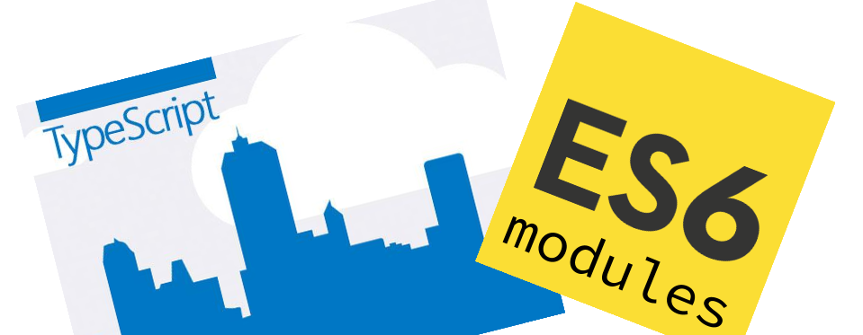

-----

<!-- .slide:data-background="#1A3819" -->
<span style="color:white">이건 궁금하실거 같아요</span>

## Typescript 왜 썼나요? <!-- .element: class="fragment" -->

-----

왜 쓰긴...
## 필요하니깐 썼죠!

-----

## egjs 2.x 작업

<span class="yellow">eg.MovableCoord</span>를 개선해보자.

-----

## eg.MovableCoord

<div style="display:flex; background-color:white; justify-content: space-between; color: black; padding:30px; border-radius: 20px">
  <div style="width:30%">
  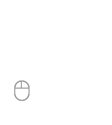
  <div>마우스, 터치로<br>이동하는 이벤트</div>
  </div>
 <div style="width:30%" class="fragment">
  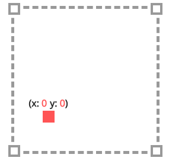
  <div>x, y 축값으로 변경</div>
  </div>  
  <div style="width:30%" class="fragment">
  
  <div>UI로 결과 반영</div>
  </div>    
</div>


-----

## 뭘 개선하려는데?

<span class="underline">마우스하고 터치</span><span class="yellow">만</span>...<br>
<span class="underline">x,y 축</span><span class="yellow">만</span>...

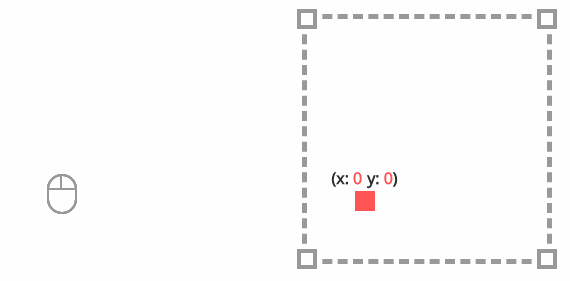


-----

<div>
  <span class="yellow">줌</span>으로도 좌표를 만들고 싶은데...<br>
  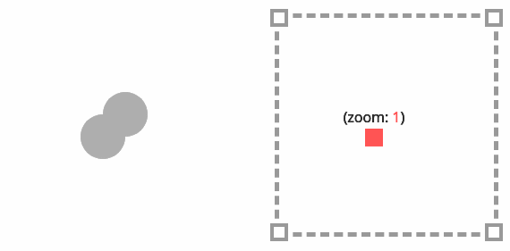
</div>

-----

<div>
  <span class="yellow">마우스 휠</span>로도 좌표를 만들고 싶은데...<br>
  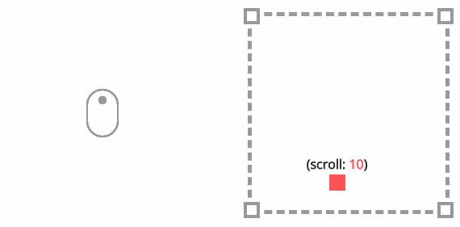
</div>

-----

<div>
  <span class="yellow">키보드</span>로도 좌표를 만들고 싶은데...<br>
  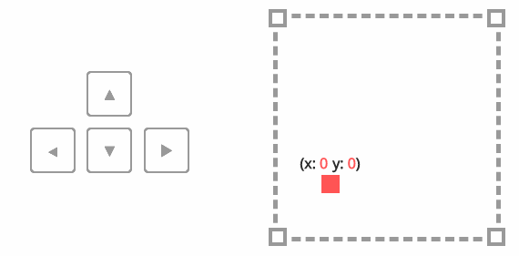
</div>

-----

## 아무거나 <!-- .element: style="color:#FF5E99" --> 
를 좌표로 만들고 싶은데...
### ???

-----

## 어떻게 하지?

이런거 예전에 많이 본 것 같은데...<br>
발음 어려웠던 거였는데...

## Polymorphism! <!-- .element: class="fragment yellow" -->

-----

<strong>동일 형태. 동일 역할</strong>이지만 <strong class="yellow">구현체만 다르게</strong> 하면 되겠네.<br>
상속은 커플링이 커지니깐 <strong class="blue bigsize">인터페이스</strong>로 하면...

##### 자바스크립트에는 없는데...

-----

뭐 없어도 지금까지 잘썼는데<br>

그냥. <strong>자바스크립트</strong>로 구현 열심히 하고 
## <span class="yellow">문서화</span> 잘해야겠다

-----

### 아! 또 있었지.
<span class="underline">x, y 축</span><span class="yellow">만</span>...

-----

2개 축만 사용하는게 아니라 <span class="yellow bigsize">N개의 축</span>을 사용
<div style="display:flex; background-color:white; justify-content: space-between; color: black; padding:30px; border-radius: 20px">
  <div style="width:50%">
    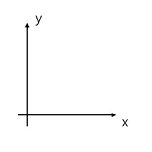
    <div>x, y 좌표로 변환</div>
  </div>
  <div style="width:50%" class="fragment">
    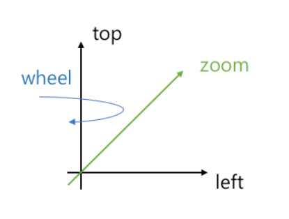
    <div>zoom, left, top, wheel, keyboard…. 좌표로 변환</div>
  </div>
</div>

-----


<span class="bigsize">헐~</span> 다시 만들어야겠다.

<div class="fragment">
<p>만드는 김에 MovableCord를 <strong class="bigsize">Axes</strong>로 바꿔야겠다.</p>

<small><a href="http://d2.naver.com/helloworld/0590136">D2 Hello world "사용자의 액션에 반응하는 UI 라이브러리, eg.Axes"</a></small>
</div>

-----

테스트 코드 충분!!!<br>
<strong class="bigsize">Coverage 93%</strong>

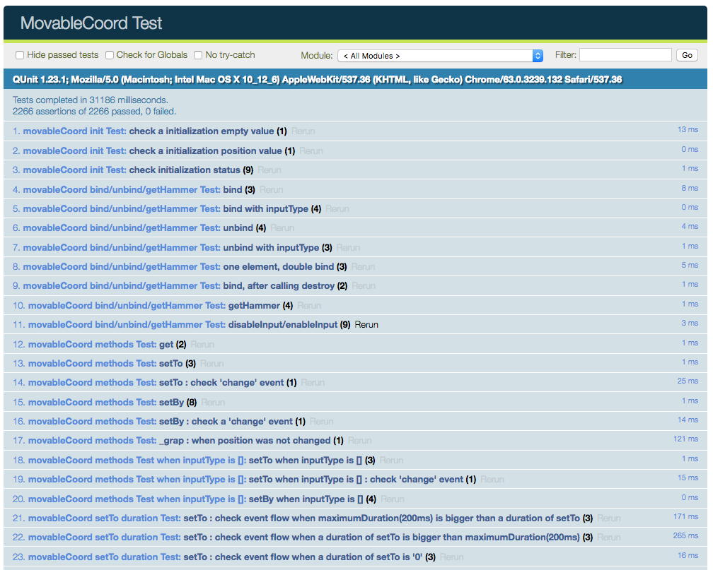

-----

### 별도움이 안되었음.

내부 구조 변경이 아닌 <em>API 자체 변경</em>이어서


-----

# 아하!
## <span class="yellow">Typescript</span>가 있었지


-----

### 다양한 입력 타입은
IInputType <strong>인터페이스</strong>를 적용

```ts
interface IInputType {
  axes: string[];
  element: HTMLElement;
  mapAxes(axes: string[]);
  connect(observer: IInputTypeObserver): IInputType;
  disconnect();
  destroy();
}
```

-----

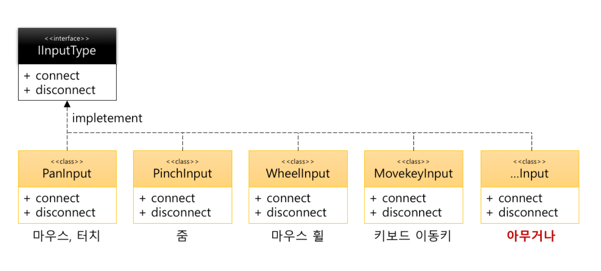

<strong class="yellow">기능별</strong>로 구현하자!

-----

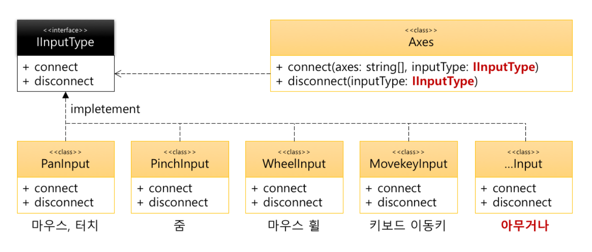

Axes와는 <strong>Loosely coupling</strong> 관계

-----

<iframe style="background-color:white; border-radius:10px; padding:10px" width="100%" height="570px" src="https://naver.github.io/egjs-axes/assets/html/axes.html"></iframe>

-----

<!-- .slide:data-background="#e7ad52" data-transition="zoom" -->
## Typescript로 얻은 것!

<p style="color:white">The Good Parts</p>

-----

### 1. 코드 의도가 분명해짐

interface로 <strong>설계 의도가 코드에 명확히 보임</strong>


<pre><code data-trim data-noescape>
class <mark>PanInput implements IInputType</mark> {
  connect(observer: IInputTypeObserver): IInputType {
    // ...
  }
  disconnect() {
    // ...
  }
}
</code></pre>

-----

<strong class="yellow">definition 파일</strong>까지 자동으로 만들어 줌

PanInput.d.ts 파일 생성
```js
export declare class PanInput implements IInputType {
    hammer: any;
    element: HTMLElement;
    static getDirectionByAngle(angle: number, thresholdAngle: number): DIRECTION;
    static useDirection(checkType: DIRECTION, direction: DIRECTION, userDirection?: DIRECTION): boolean;
    constructor(el: string | HTMLElement, options?: PanInputOption);
    connect(observer: IInputTypeObserver): IInputType;
    disconnect(): this;
    destroy(): void;
    private onHammerInput(event);
    private onPanmove(event);
    private onPanend(event);
    //...
}
```


-----

### 2. 안정성

구현 해야할 것을 안했다면... <strong>멤메</strong>

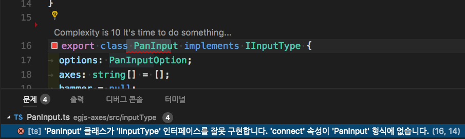

<p class="fragment">더군다나...툴을 쓰면 <strong class="yellow">구현체 형태</strong>까지 만들어 줌</p>

-----


잘못된 값을 넣거나 필수값을 안넣으면... <strong>멤메</strong>

<pre><code data-trim data-noescape>
const axes = new Axes({
  // range 값이 필수. 없어서 에러. 
  // 'range' 속성이 '{ circular: true; }' 형식에 없습니다.
  <mark>rotateX: {
    circular: true  
  },</mark>
  rotateY: {
    range: [0, 360],
    circular: true
  }
}, {
  // 잘못된 값을 넣어서 에러
  // 'string' 형식은 'number' 형식에 할당할 수 없습니다.'
  deceleration: <mark>"0"</mark> 
});
</code></pre>

-----


### 3. 편의성
<strong>점(.)</strong>의 Code Assist 와

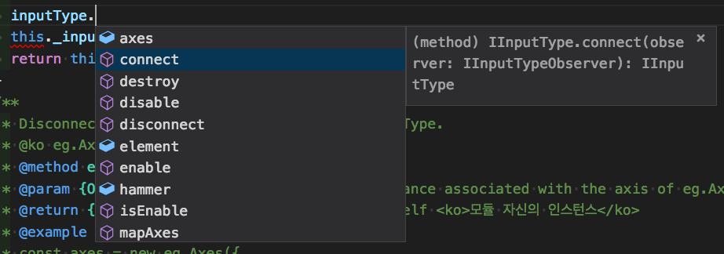


-----

<strong>코드 이동</strong>은 덤!

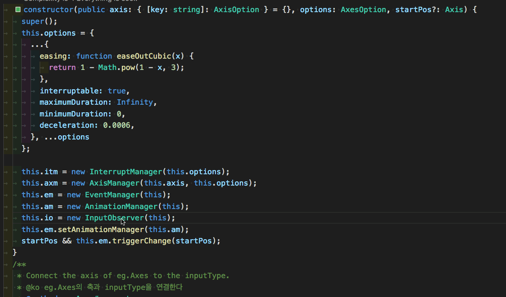

-----

사용자 정보를 <strong class="yellow">좌표로 변환</strong>해야하는 경우가 많음.

<div style="display:flex; background-color:white; justify-content: space-between; color: black; padding:30px; border-radius: 20px">
  <div style="width:50%">
  
  <div>다양한 입력 데이터</div>
  </div>
 <div style="width:50%">
  
  <div>N개의 축 값으로 변경</div>
  </div>  
</div>


-----

data이지만 같은 data가 아님
<pre><code data-trim>[{
  name: "손찬욱",
  age: "먹을 만큼 먹음",
  weight: "알아서 뭐하게"
}, { /* ... */ }, // ...
].map((<mark>data</mark>) => ({
  name: x.name,
  orgAge: x.age,
  orgWeight: x.weight,
  <mark>age</mark>: isNaN(x.age) ? 20 : x.age,
  <mark>weight</mark>: isNaN(x.weight) ? 60 : x.weight,
  // ...
})).map((<mark>data</mark>) => { // ... })
}).reduce((<mark>data</mark>) => { // ... })
</code></pre>

-----

데이터의 타입이 있어서 <strong class="bigsize">오~</strong>
<pre><code data-trim>[{
  name: "손찬욱",
  age: "먹을 만큼 먹음",
  weight: "알아서 뭐하게",
  family: ["hong", "june", "seo"]
}, { /* ... */ }, // ...
].map((<mark>data: UserInfo</mark>) => ({
  name: x.name,
  orgAge: x.age,
  orgWeight: x.weight,
  age: isNaN(x.age) ? 20 : x.age,
  weight: isNaN(x.weight) ? 60 : x.weight
})).map((<mark>data: StoredUser</mark>) => {
  <span class="fragment"><mark>data.orgAge;</mark></span>
  <span class="fragment"><mark>data.family;</mark> // Error</span>
}).reduce((<mark>data: User</mark>) => // ...)
</code></pre>

-----

### 3. 데이터 흐름 추적 (안정성)

데이터를 <strong class="yellow">전달</strong>하거나 <strong class="yellow">변형</strong>하는 경우에는 
<strong class="bigsize">Great!!!</strong>

<div class="fragment">
  <h4><span class="underline">lodash</span>나 <span class="underline">rxjs</span>와 같은 류의 라이브러리와 캐미가 좋음</h4>
</div>

-----

<!-- .slide: data-transition="fade-in" data-background-transition="fade-in"-->
#### eg.Axes의 브라우저 지원 범위
|IE|Chrome|Firefox|Safari|iOS|Android|
|---|---|---|---|---|---|
|<strong>10+</strong>|Latest|Latest|Latest|7+|2.3+|

-----

<!-- .slide: data-transition="fade-in" data-background-transition="fade-in"-->
#### eg.Axes의 브라우저 지원 범위
with [hammerjs-compatible](https://github.com/naver/hammerjs-compatible)

|IE|Chrome|Firefox|Safari|iOS|Android|
|---|---|---|---|---|---|
|<strong>8+</strong>|Latest|Latest|Latest|7+|2.3+|


-----

#### IE의 <strong>ES5</strong> 지원여부

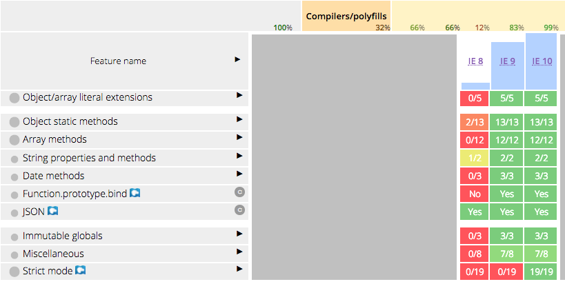

-----

### 4. 결과 코드의 폭넓은 지원 범위
Typescript는 공식적으로 <strong>ES3</strong>을 지원

<pre><code data-trim>
{
  "compilerOptions": {
    <mark>"target": "es3"</mark>,
    // ...
  }
}
</code></pre>

<small class="underline">Babel은 공식적으로 ES3을 지원하지 않습니다.</small>
<small>babel에서 ES3을 지원하기 위해서는... 많은 작업을 해야합니다 ㅠㅠ</small>

-----

<!-- .slide:data-background="#8c4738" data-transition="zoom"-->
## Typescript로 잃은 것!

The Bad Parts

-----


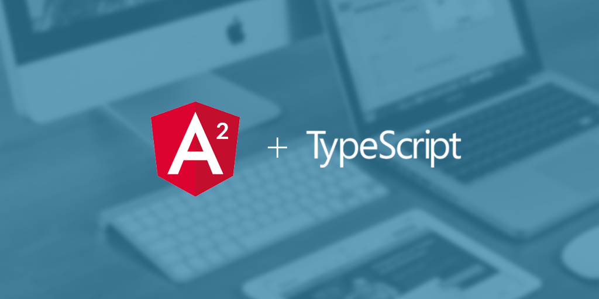


-----

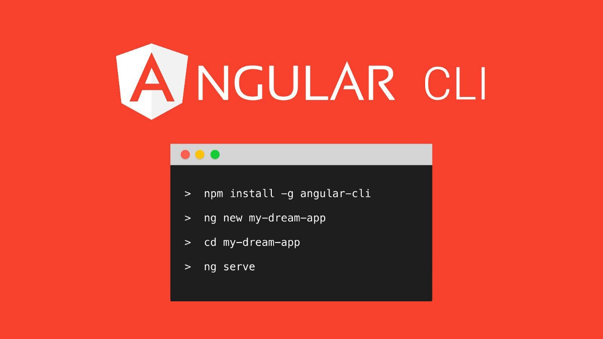

-----

### Typescript 너무 좋아


-----

### 막상 내가 해보니...


-----

### 1. 3'rd party 라이브러리 사용 시
Axes는 <em>Hammerjs</em>를 사용함.

-----

#### 어라? Hammer를 왜 가져올 수가 없지?

<pre><code data-trim>
import Hammer from "hammerjs";

</code></pre>

- TypeScript에서는 <strong>undefined</strong>
- Babel에서는 <strong class="blue">Hammer</strong>


-----

#### 야호 된다!

<pre><code data-trim>
import * as Hammer from "hammerjs";

</code></pre>

- TypeScript에서는 <strong class="blue">Hammer</strong>
- Babel에서는 <strong class="blue">Hammer</strong>

-----

#### 이런 상황이 왜 발생하는가?

##### ES6 Module spec

<pre><code data-trim>
// foo.js
export var bar = 'bar'  
export default 'foo';

// app.js
import foo from './foo';  
<mark class="fragment">// foo => 'foo'</mark>
import * as fooModule from './foo';  
<mark class="fragment">// fooModule => { bar: 'bar', default: 'foo' }</mark>
</code></pre>

-----


hammerjs는 <strong>UMD</strong> 형태로 지원.

하지만, <span class="underline">ES6 Module</span>로 호출시 <span class="yellow">CommonJS 형식으로 인식</span>

<pre><code data-trim>
if (typeof define === 'function' && define.amd) {
    define(function() {
        return Hammer;
    });
} else if (typeof module != 'undefined' && module.exports) {
    <mark>module.exports = Hammer;</mark>
} else {
    window[exportName] = Hammer;
}
</code></pre>

-----

CommonJS 방식으로 개발
```js
// commonjs로 모듈을 반환
module.exports = Hammer;  // (babel)
export = Hammer;  // (typescript)
```

ES6 Module 방식으로 사용
<pre><code data-trim>
// ES6 module방식으로 사용
import Hammer from "hammerjs";
<mark class="fragment">// Hammer는 default 없이 객체를 넘겼으니...'undefined'</mark>
import * as HammerModule from "hammerjs";
<mark class="fragment">// HammerModule은 넘김 객체를 가리키는 것이니... 'Hammer'</mark>
</code></pre>

-----

### TypeScript가 <strong>정상</strong> 이네...

근데 Babel은 왜 되었지?

-----

<em>transform-es2015-modules-commonjs</em>을<br>
기본 preset에서 제공함.

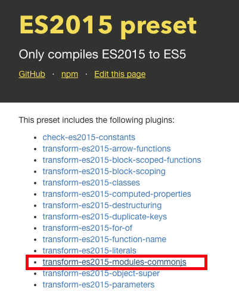

-----

<pre><code data-trim>
function _interopRequireDefault(obj) { 
  return <mark>obj && obj.__esModule ? obj : { default: obj };</mark>
}
var _hammerjs = __webpack_require__(9);
var _hammerjs2 = <mark>_interopRequireDefault(_hammerjs);</mark>
// _hammerjs2를 사용.
</code></pre>

-----

So, <strong class="yellow">CommonJS</strong>, UMD 방식으로 만들어진 모듈을 가져올 때는...


```js
import * as Hammer from "hammerjs";

import Hammer = require("hammerjs");
```

-----

#### 하지만, 문제는 여기서 그치지 않습니다.

<small>Typescript가 자동으로 만든 type definition의 경우 다음과 같은 형태</small>
<pre><code data-trim>
// definition file
declear class Hammer {}

</code></pre>
<pre><code data-trim>// use service
import * as Hammer from "hammerjs";

<mark class="fragment">Hammer.blabla;</mark>
</code></pre>


<strong class="fragment">Type 에러!</strong>

-----


Hammer를 <strong>namespace</strong>로 인식하죠.

<div class="fragment" >
  <pre><code data-trim>
  declare namespace Hammer {}
  </code></pre>
  <br>
  <small class="grey">hammerjs의 타입 정의 파일은 모두 namespace 로 선언되어 있습니다.</small>
<div>

-----

다행인 것은 

요즘 모듈들은 <span class="yellow">UMD</span> 뿐만 아니라 <strong>ES6 Module</strong> 용도 함께 배포


package.json에서 지원
 <pre><code data-trim>
{
  "main": "dist/axes.js", // umd or commonjs 형태 [번들링 된 것]
  <mark>"module": "outjs/index.js", // es6 module 형태</mark>
}
</code></pre>
```js
import Axes from "egjs/axes"; // module에서 명시한 파일을 찾음.
```

#### <em>For Tree-shaking</em>

-----

### 2. 3'rd party 라이브러리 @types 사용 시

-----

<pre><code data-trim>interface HammerOptions {
  <mark>cssProps?:CssProps;</mark>
  recognizers?:RecognizerTuple[];
  // ...
}
</code></pre>

<div class="fragment">
<p>정작 CssProps 내부 속성은 다 <strong>필수</strong></p>
<pre><code data-trim>interface CssProps {
  contentZooming:string;
  tapHighlightColor:string;
  touchCallout:string;
  touchSelect:string;
  userDrag:string;
  userSelect:string;
}
</code></pre>
</div>

-----

3'rd party 라이브러리의 <strong>@types</strong>가 많이 있지만...

<div  class="fragment">
<h4>결국. 다시 정의 ㅠㅠ</h4>

</div>

-----

### 3. 과한 사용은 오히려 독!

함수에 Generic을 쓰고, 파라미터와 반환값 모두 함수인 arrayMap

<pre><code data-trim>
function arrayMap<T, U>(f: (x: T) => U): (a: T[]) => U[] {
  return a => a.map(f);
}

<mark class="fragment">arrayMap((x: string) => x.length);</mark>

<mark class="fragment">// T는 string. U는 number</mark>
<mark class="fragment">// string 배열을 파라미터로 받고 number 배열을 반환하는 함수</mark>
</code></pre>

-----

<pre><code data-trim>
let lengths: (a: string[]) => number[] = arrayMap(s => s.length);

</code></pre>

<pre class="fragment"><code data-trim>
<mark>// 변수 정의</mark>
let lengths: (a: string[]) => number[];

</code></pre> 
 
<pre class="fragment"><code data-trim>
<mark>// 값 할당</mark>
lengths = arrayMap(s => s.length);

</code></pre> 

-----

개발경력 13년 
### 코드 한 줄도 못 읽음.

자존감 붕괴


-----

<!-- .slide:data-background="#1A3819" -->
## 정리 한번 해보죠.

-----

### 좋은 점 (얻은 것)
<ul>
  <li class="fragment"><strong class="yellow">코드가 명확</strong>해지고, 별도 주석을 안달아도 <span class="underline">명세화</span>가 가능하다</li>
  <li class="fragment"><strong>안전성</strong>. 구현의 실수를 개발중 잡아준다.<br>특히, <span class="underline">데이터 전달과 변환</span>이 많은 곳에서는 <strong>Great!</strong></li>
  <li class="fragment"><strong class="blue">편의성</strong>. 툴 사용의 극대화!!!</li>
  <li class="fragment"><strong class="grey">ES3</strong>까지 손쉽게 지원</li>
</ul>

-----

### 나쁜 점 (잃은 것)
<ul>
  <li class="fragment">
    <strong class="yellow">외부 모듈 사용</strong>이 불편하다
    <ul >
      <li class="fragment"><p>UMD나 CommonJS 형태의 <span class="underline">기존 모듈 사용시 번거롭다</span></p></li>
      <li class="fragment"><p><span class="underline">외부 type definition 파일</span>이 완벽하지는 않다.</p></li>
    </ul>
  </li>
  <li class="fragment">과하게 쓰면 오히려 <strong class="blue">가독성을 떨어뜨린다.</strong> 떨어지는 자존감 ㅜㅜ</li>
</ul>

-----


### 그럼 다음에 기회가 된다면 

## <strong class="yellow">Typescript 쓰겠어요? 안쓰겠어요?</strong>

-----

# <strong class="bigsize">YES!</strong>

<div class="fragment">
  <h2>Why?</h2>
  <p>단점의 핵심은 <strong class="yellow">기존 시스템과의 이질감</strong>, <span class="underline">"過猶不及"</span></p>
</div>

