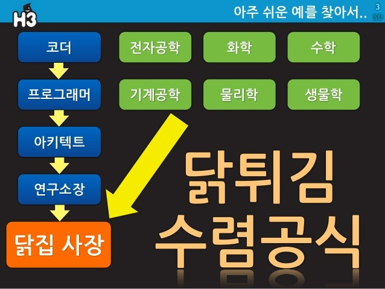

# Hello

-----

아내와 아들 그리고 딸 밖에 모르는 남편인 "직장인 개발자"

## [손찬욱](http://sculove.github.io)

-----

> - NAVER FE플랫폼 재직중
> - LG CNS 공공SW 아키텍쳐팀

- [iScroll](https://github.com/cubiq/iscroll) 오픈소스 커미터
- [egjs](https://github.com/naver/egjs) 오픈소스 개발자
- [JMC](https://github.com/naver/jindojs-jmc) 오픈소스 개발자
- `쉽고 빠른 모바일웹 UI개발` 저자

-----

오늘 할 이야기는

## __산업에 적용된 오픈소스__인데...

Note: 이 이야기가 여러분에게 얼마나 가치가 있을지 의문이 들었다.

-----

<!-- .slide: data-background-image="./image/backtothefuture.jpg" -->

Note: 내가 학부 시절로 돌아 갔을때 미리 알았다면 좋았을 것들을 이 주제에 맞게 생각해봤다.

-----

<!-- .slide:data-background="#1A3819" -->
## 오늘 할 이야기?

## 직장인 개발자 <!-- .element: class="fragment yellow" -->

## 오픈소스 <!-- .element: class="fragment yellow" -->

-----

<!-- .slide: data-background="#e7ad52" -->
# 직장인 개발자

-----

### 프로그래머(개발자)? 

> 컴퓨터 프로그램의 논리나 알고리즘을 설계하고, 원시 코드를 작성하여 테스트하는 사람을 말한다

Note: 프로그래머하면 무엇이 생각나나요?
누가 이야기 좀 해 볼까요?

-----

<!-- .slide: data-background-image="./image/whoareyou.jpg" -->

-----

Note: 오덕 스런 개발자. 건들지마

-----

Note: 헐렁한 체크무늬 남방과 백팩으로 대표되는 ‘개발자 패션`
WWDC 에서 Swift를 오픈소스로 바꾼다고 발표할때

-----

## 당신은 개발자인가요??

-----

-----

-----

## 당신이 알아야 할 개발자의 삶

-----

<h3 class="fragment">__현실?__ __연봉?__ 종류?</h3>

-----

<h3 class="fragment">__되는 과정?__ 연봉? 종류?</h3>

-----

## 도대체 __현실__이 어쨌길래?

-----

- "IT 개발자?…부품과 다를 바 없어요"
- "한 번 출근하면 3박4일… 집에 좀 보내줘" 고통 받는 게임개발자들 <!-- .element: class="fragment" -->
- [LX전자, 스마트폰 개발자 2명 사망] 과도한 업무가 부른 비극? <!-- .element: class="fragment" -->
- NXX·NX소프트, 잇단 사망자 발생… 게임업계 냉혹한 ‘민낯’ <!-- .element: class="fragment" --> 

-----

-----

## 힘들더라도...

-----

-----

그런데... 다 마찬가지

-----

-----

## 지금 까지는...

-----

- 4차 산업혁명의 열쇠 이제 코딩교육이 뜬다!
- 4차 산업혁명, SW가 기회… 미래부, SW 교육과 산업 지원 강화 <!-- .element: class="fragment" --> 
- LG CNS, '코딩 천재' 2,500명 키운다 <!-- .element: class="fragment" --> 

-----

- 출퇴근 자율, 휴가도 마음대로… 병원비까지 복지천국 네XX
- 네XX, 개발자 문화 가꾸기 나선다 <!-- .element: class="fragment" --> 
- '人=재산'...소셜커머스, 복지 강화로 5조 시장 잡는다 <!-- .element: class="fragment" --> 
- '대기업 직원 연봉 1위' DXXXX, 복지도 최고 "회사 내 모유수유방까지" <!-- .element: class="fragment" --> 

Note: 재택근무, 자율출퇴근제, 조식/석식, 카페테리아, 빠방한 장비, 의자, 건강보험, ...

-----

<!-- .slide: data-background-image="./image/feature.jpg" -->

-----

<!-- .slide: data-background-image="./image/backtothefuture.jpg" -->

Note: 다시 현실로 돌아와서...

-----

<!-- .slide: data-background-image="./image/choice.jpg" -->

-----

### 꿈 VS 현실
### 창업 VS 취업 <!-- .element: class="fragment" -->
### ... VS ... <!-- .element: class="fragment" -->

-----

<!-- .slide: data-background-image="./image/fun.jpg" -->

-----

## **취업**

-----

## 만약 IT 직장에 __첫 취직__을 한다면,
- 종사할 산업을 찾아라. <!-- .element: class="fragment" -->
- 회사를 찾아라. <!-- .element: class="fragment" -->
- 직군을 찾아라. <!-- .element: class="fragment" -->

-----

## 종사할 IT 산업
> SI, 포탈, 게임, 전자, 커머스, 솔루션, ...

- 산업의 구조를 내가 이해하고 있는가? <!-- .element: class="fragment" -->
- 산업의 구조와 내 라이프 스타일과 맞는가? <!-- .element: class="fragment" -->
- 계속 성장하는 산업인가? <!-- .element: class="fragment" -->

-----

## 회사
> 구글, 페이스북, 삼성전자, 네이버, LG전자, LG CNS, 삼성 SDS, 카카오, 엔씨소프트, ...

- 주체적인 회사 <!-- .element: class="fragment" -->
- 계속 성장하는 회사. <!-- .element: class="fragment" -->

-----

## 직군
> - Web, App, Embedded, ...
> - Front-end, Server, Database, ...

- 내가 재미있게 할수 있는 일이 무엇인가? <!-- .element: class="fragment" -->
- 내가 하는 일이 회사의 주요 업무인가? <!-- .element: class="fragment" -->

-----

## 회사에 입사할 때 알아야 할 시각

-----

## 1. 회사는 __분업화된 조직__.

### 협업이 굉장히 중요한 일이다.

-----

서로의 시각과 입장을 이해하는게 중요함

-----

### 2. 회사에서는 처음부터 새로운 것을 만드는 것보다 

## __남이 짜 놓은 코드__를 보는 일이 더 많다.

-----

- 나보다 남의 코드를 잘 봐야한다.
- document가 중요하다.

-----

## So,...오픈소스 활동을 해보시라

<h2 class="fragment"> <strong>GitHub Repository === RESUME</strong></h2>

-----

<!-- .slide:data-background="#1A3819" -->
# 오픈소스

-----

### OOO 기능을 개발해야 하는 상황,
### 어떻게 하시나요?

-----

## 아마도 다음 옵션 중 한가지

## 1) 직접 개발 <!-- .element: class="fragment" -->
<h2 class="fragment"> 2) <strong>오픈소스</strong> 사용</h2>

-----

## 1) 직접 개발

-----

-----

I'll handle it

-----

-----

-----

## 2) 오픈소스 사용

-----

### __집단 지성__의 산출물

-----

오픈 소스의 문제점 1.

### 정말 안정적인가? 검증된 것인가?

<h3 class="fragment">많은 <strong>레퍼런스</strong>가 존재하는가?</h3>

-----

사실 오픈소스가 너무 많음.

-----

### 너 믿고 쓸 만하니?

<ul class="size40">
    <li class="fragment">github 지표들 (star, fork, watch)</li>
    <li class="fragment">인기도 - https://stats.js.org/</li>
    <li class="fragment">stackoverflow 게시글(질문/답변) 수</li>
    <li class="fragment">마지막 commit 날짜</li>
    <li class="fragment">충분한 레퍼런스 문서 여부</li>
    <li class="fragment">기타 등등...</li>
</ul>

-----

### 만약 문제가 생기면?
 <!-- .element: class="fragment" style="height:300px" -->

-----

### 이런 문제만 해결할 수 있다면...

-----

산업에서는 

## __비용__과 __안정성__ 고려시
## 오픈소스 사용이 현실적 방법

-----

<!-- .slide: data-background-image="./image/naver.png" -->

-----

# 오픈소스를 씁니다 :)

-----

## 기본 원칙 1

##  <strong>오픈소스</strong>의 활용
<ul class="fragment">
    <li>좋은 오픈소스가 있다면, 사용한다.</li>
    <li>필요한 경우, 커스터마이징 한다.</li>
</ul>
 
<h2 class="fragment green">자체 기술력 향상</h2>

-----

## 기본 원칙 2

## 직접 개발하는 경우
<ul class="fragment">
    <li>기능/성능이 아쉬운 경우</li>
    <li>필요한 기능을 가진 라이브러리가 없는 경우</li>
    <li>전략적 기술 확보 필요성</li>
</ul>

-----

&nbsp;

> 주요 웹 UI/UX 개발을 돕는 UI 인터랙션, 이펙트,
> 유틸리티로 구성된 자바스크립트 라이브러리

http://naver.github.io/egjs/

-----

### egjs가 사용하는 오픈소스

-----

# + a

-----

### eg.InfiniteGrid

 <!-- .element: style="height:450px" -->

**기능/성능이 아쉬운 경우**

-----

## [eg.IniniteGrid](http://naver.github.io/egjs/demo/infiniteGrid/) vs [Masonry](http://masonry.desandro.com/)

<iframe width="728" height="410" src="https://www.youtube.com/embed/6Kv-NV0dZXw" frameborder="0" allowfullscreen></iframe>
<!-- video width="728" height="410" src="./img/infiniteGrid-masonry.mp4" frameborder="0" controls></video -->

    https://youtu.be/6Kv-NV0dZXw

-----

### eg.Flicking

**전략적 기술력 확보**

-----

### 네이버 메인

전 국민이 모두 보는 화면

 <!-- .element: style="height:450px" -->

-----

### 쇼핑의 화려한 UI

http://m.swindow.naver.com/department/home

-----

### eg.Photo360Viewer

 <!-- .element: style="height:400px" -->
 <!-- .element: style="height:400px" -->

**필요한 기능을 가진 라이브러리가 없는 경우**

http://m.blog.naver.com/catives/220901318171

-----

## 네이버는 오픈소스를 활용하고, 
## 부족한 부분을 채워서

-----

## 다시 오픈소스 생태계에
## __기여하는 역할__을 하고자 한다.

-----

## 왜? __기술력__을 중시하는
### 개발자 중심의 회사이기 때문이다.

-----

## 오픈 소스를 활용하는 것도
## 기술력인가?

-----

포르쉐 마칸 VS 아우디 Q5

-----

## 원천기술 VS 활용 기술

<h2 class="fragment">시장에 어떤 <strong>가치</strong>를 주느냐?</h2>

-----

# 정리해보자

## 직장인 개발자
## 오픈소스

-----

- 직장인 개발자가 첫 직장을 구할 때
- 직장인 개발자가 회사에 입사하기 전에 알아야하는 시각 <!-- .element: class="fragment" -->
- 자체 개발 VS 오픈소스의 장단점 <!-- .element: class="fragment" -->
- 네이버의 오픈소스에 대한 방향성 <!-- .element: class="fragment" -->
